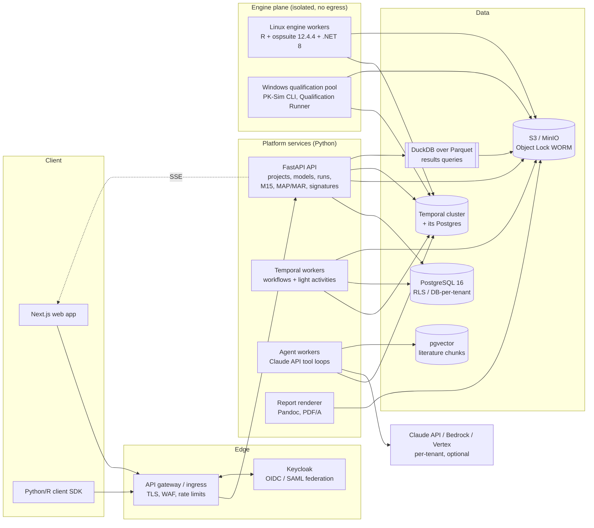
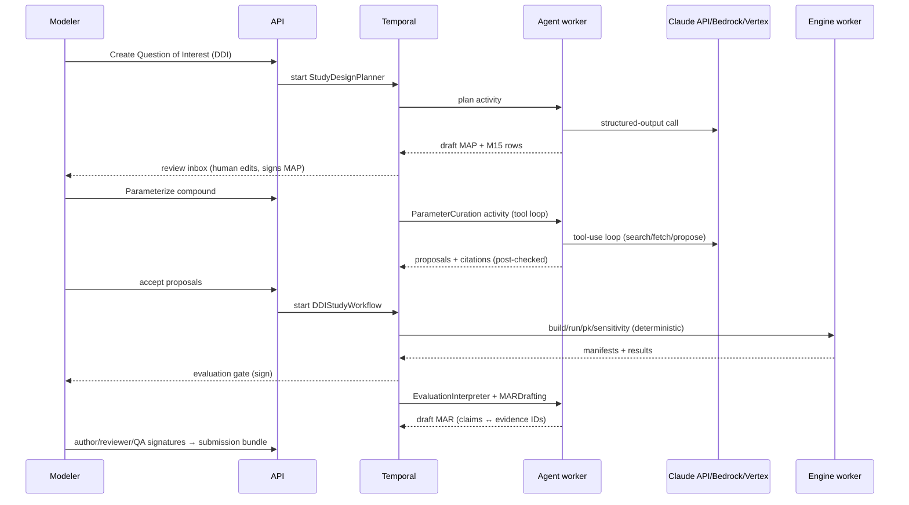
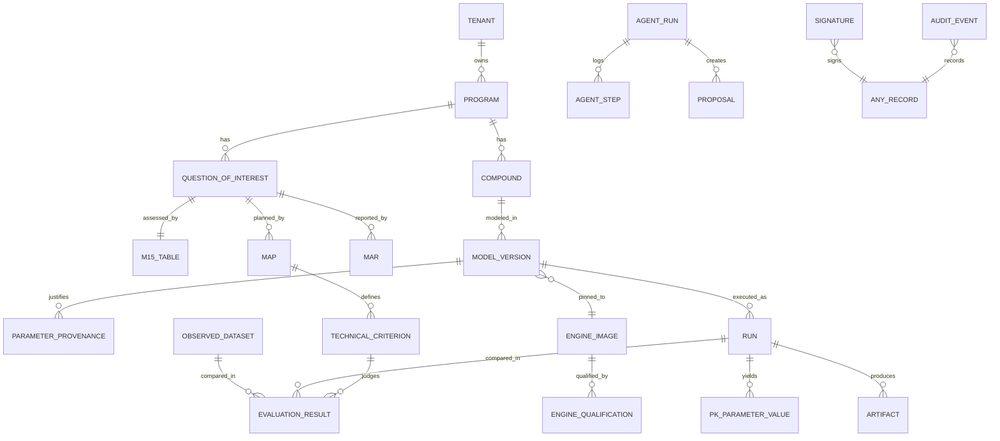

# Modeler One — End-to-End PBPK Automation Platform on PK-Sim

**Architecture Pack · DRAFT v0.2 · 2026-09-15**
v0.2 corrects the engine facts after installing and running the OSP engine (ospsuite 12.4.4, PK-Sim 12.3.173, .NET 8) and adds acceptance criteria, data intake, fitting rounds and MCP sources; see [WORKFLOW_AND_AUTOMATION.md](WORKFLOW_AND_AUTOMATION.md) for the verified results and server sizing.
Audience: engineering leads, PBPK scientists, QA/CSV (computer system validation), legal.

Markers used throughout:
- **[VERIFIED 2026-09-15]** — checked against a primary source in this research pass (sources in §11).
- **[VERIFY]** — plausible but not confirmed; must be signed off by a PBPK SME, QA, or legal before a build decision depends on it.
- **[BENCHMARK]** — an engineering estimate to be replaced by measurement.

---

## 0. Assumptions

| # | Assumption | Consequence if wrong |
|---|---|---|
| A1 | Submissions target FDA, EMA and PMDA. ICH M15 (adopted 29 Jan 2026) is the common framework; regional PBPK reporting guidance sits on top of it. | Add a region-specific report template set. |
| A2 | The only mechanistic engine is the open-source OSP Suite (PK-Sim + MoBi). No Simcyp or GastroPlus. | The engine-adapter boundary (§5.3) contains the impact. |
| A3 | Observed clinical data is aggregated or pseudonymized. No direct patient identifiers are stored. | Adds a GDPR/HIPAA data-protection layer (de-identification service, DPIA per tenant). |
| A4 | One codebase ships as three deployment profiles: `saas-pooled`, `cro-silo`, `onprem-single`. | — (the user decided this) |
| A5 | LLM agents *propose*; they never write a number into a locked model or a report table without deterministic provenance and a human accept action. | — (non-negotiable for submission-grade work) |
| A6 | Delivery team: ~10 engineers, 2 PBPK scientists, 1 CSV/QA lead. | The roadmap timeline scales roughly linearly. |

---

## 1. Executive Summary

**Goal.** Modeler One turns PK-Sim from a desktop tool run by one expert into a governed, multi-user, auditable service. A modeler states a *question of interest* (e.g., "Can drug X be co-administered with itraconazole, and at what dose?"). The platform then drives the whole chain: literature-backed parameterization, model building, fitting, evaluation against observed data, application simulations (DDI, pediatrics, special populations, absorption/VBE, FIH, PK/PD), and an ICH M15 assessment table plus Model Analysis Report ready for regulatory submission.

**Why now.**
1. **ICH M15 reached Step 4 on 29 Jan 2026** [VERIFIED]. It requires each MIDD question of interest to have explicit Context of Use, Model Influence, Consequence of Wrong Decision, Model Risk, Model Impact, technical criteria, and a MAP/MAR. Most PBPK groups still assemble this by hand in Word.
2. **OSP is headless today.** The released ospsuite R package 12.4.4 (PK-Sim 12.3.173 inside, .NET 8 runtime) exposes `initPKSim()`, `loadProjectFromSnapshot()`, `exportProjectToSnapshot()`, `runSimulationsFromSnapshot()`, `createIndividual()`, `createPopulation()` and simulation batches, and OSP's parameter identification package 2.2.0 runs on top of it [VERIFIED by installing and running, 2026-09-15]. Running from a snapshot and snapshot/project conversion work on Linux and Windows but not on macOS. A PK-Sim project can be *generated as JSON* and *executed on Linux* without the Windows GUI, which makes a containerized platform feasible.

**Core architectural bet.** The system of record is the **PK-Sim project snapshot (JSON)**, with typed models, content hashing, parameter-level provenance, and versioning. It is executed by **pinned, qualified engine container images**, orchestrated by **Temporal** (durable workflows with human approval gates), and surrounded by a **Part 11 compliance core** (hash-chained audit trail, e-signatures, WORM storage).

**Biggest risks.**

| Risk | Detail | Mitigation |
|---|---|---|
| Engine version drift | OSP Suite v13 is not formally released (latest formal release: v12.3 Hotfix 1, July 2024). The OSP team is migrating library snapshots to the v13 format (snapshot `Version` 80→81). v13's new oral absorption model moved 14/69 Dapagliflozin outputs by >1% (max 25%) [VERIFIED, Dapagliflozin-Model PR #12]. | Every project pins an engine image digest. Migration is its own re-evaluation workflow. |
| GPLv2 licensing | PK-Sim, MoBi and ospsuite are GPLv2 [VERIFIED]. On-prem delivery counts as distribution. | Strict process boundary, no linking, unmodified upstream, source offer. Legal review required [VERIFY]. |
| Qualification tooling | The OSP Qualification Runner is documented as Windows-only [VERIFIED]. | A Windows worker pool until a Linux path exists. |

---

## 2. Domain Map

### 2.1 Where PBPK sits in drug development

```
Discovery ─► Candidate selection ─► IND/CTA (FIH) ─► Phase 1 ─► Phase 2 ─► Phase 3 ─► NDA/MAA ─► Lifecycle (post-approval changes, generics)
   │                │                    │              │           │           │           │             │
 IVIVE,         species PBPK        FIH dose,      model verify   DDI, food   peds, organ   label claims  BE waivers,
 ADME triage    translation         safety margin  vs SAD/MAD     effect      impairment    (DDI, peds,   formulation
                                                   refine CL/Vd   ARA-DDI     VBE/safe      HI/RI)        bridging, VBE
                                                                              space
```

### 2.2 Application catalog (what "all PBPK applications" means)

Each application is delivered as an **Analysis Template** (§5.4): a declarative spec of required inputs, engine steps, evaluation metrics, default technical criteria, and report sections. One generic engine; many templates.

| App ID | Application | Typical question of interest | OSP capability used | Key inputs | Regulatory anchor |
|---|---|---|---|---|---|
| APP-01 | Compound model build & verification | Does the model describe IV/PO SAD/MAD PK? | PK-Sim compound, individual, protocol, formulation, simulation; parameter identification | phys-chem (MW, logP, pKa, fu, solubility), in-vitro CL, observed PK | ICH M15; FDA PBPK Format & Content; EMA PBPK reporting guideline |
| APP-02 | FIH & DMPK translation | Human dose giving target exposure/safety margin? | Species PBPK (rat, dog, monkey, minipig, mouse — **[VERIFY]** per engine version), human scale-up, in-vitro→in-vivo CL | microsomal/hepatocyte CLint, fu,inc, B:P, preclinical PK, NOAEL | ICH M3(R2), EMA FIH guideline |
| APP-03 | Enzyme DDI (victim & perpetrator) | AUC ratio with strong CYP3A4 inhibitor/inducer? Label dose adjustment? | Competitive/non-competitive/uncompetitive/mixed inhibition, mechanism-based inactivation, induction processes; OSP DDI qualification library | Ki,u, kinact/KI, EC50/Emax, fm per pathway, perpetrator models | ICH M12 (DDI, Step 4 2024 [VERIFY date]) |
| APP-04 | Transporter DDI | OATP1B1/P-gp/BCRP inhibition effect? | Transporter processes + inhibition | Km/Vmax or CLint,T, IC50/Ki, transporter expression | ICH M12 |
| APP-05 | Pharmacogenomics | Exposure in CYP2D6 PM vs EM? | Expression profile scaling, phenotype populations | activity/abundance by genotype | FDA PGx labeling |
| APP-06 | Pediatric extrapolation | Dose for 2–<6 y matching adult AUC? | PK-Sim ontogeny, age-dependent physiology, pediatric populations | enzyme ontogeny, adult verified model, pediatric data if any | ICH E11A (Step 4 2024 [VERIFY date]) |
| APP-07 | Hepatic impairment | AUC change in Child-Pugh B/C? | Disease-state parameterization (blood flows, enzyme abundance, albumin, hematocrit) — **[VERIFY]** built-in disease state vs literature scaling | Child-Pugh physiology scaling set | FDA/EMA HI guidances |
| APP-08 | Renal impairment | Dose for eGFR 15–29? | CKD disease state (**[VERIFY]** PK-Sim version support), GFR scaling | eGFR, fe, renal transporter fraction | FDA/EMA RI guidances |
| APP-09 | Pregnancy & lactation | Exposure by trimester? Infant dose via milk? | PK-Sim pregnancy population (**[VERIFY]** name/version); lactation needs MoBi extension | gestational-age physiology, milk:plasma | FDA pregnancy/lactation PBPK practice |
| APP-10 | Geriatrics, obesity, ethnicity | Exposure in >75 y / BMI >40 / Japanese? | Populations: NHANES, Japanese, Asian, ICRP (**[VERIFY]** exact population list per version) | demographics | ICH E5, E7 |
| APP-11 | Absorption & formulation | Is dissolution rate-limiting? Which formulation? | Formulations: dissolved, Weibull, Lint80, particle dissolution, table [VERIFIED Weibull in snapshot]; intestinal permeability | dissolution profiles, particle size, solubility-pH | FDA PBPK biopharmaceutics draft guidance (2020 [VERIFY]) |
| APP-12 | Food effect | Fed vs fasted AUC/Cmax? | Meal events, e.g. `Meal: High-fat breakfast (Human)` [VERIFIED event template in snapshot] | fed-state solubility (FeSSIF), bile micelles | FDA food-effect guidance |
| APP-13 | pH-dependent DDI (acid-reducing agents) | Effect of PPI co-administration? | gastric pH modification, solubility-pH table | pKa, solubility vs pH, precipitation | FDA ARA-DDI guidance |
| APP-14 | Virtual bioequivalence & safe space | Would a slower-dissolving batch be BE? | Population simulations with IIV + intra-subject variability; deterministic BE statistics (platform) | dissolution specs, variability estimates | FDA biopharm PBPK draft; product-specific guidances |
| APP-15 | Tissue/target-site exposure | Unbound brain or tumor interstitial concentration? | Organ sub-compartment outputs (interstitial, intracellular) | Kp method, permeability | CoU-specific |
| APP-16 | Biologics / large molecules | mAb PK, FcRn-mediated clearance, TMDD? | PK-Sim large-molecule model (two-pore, FcRn) [VERIFY feature scope]; TMDD via MoBi | MW, hydrodynamic radius, FcRn affinity, target turnover | CoU-specific |
| APP-17 | PK/PD | Exposure → receptor occupancy / biomarker / effect? | MoBi extension of the PK-Sim model (reactions, observers), or sequential PBPK→PD in R (rxode2) | PD parameters (Emax, EC50, kin/kout) | ICH M15; E4 |
| APP-18 | Dose & regimen optimization | Regimen that keeps Ctrough > target in 90% of patients? | Population sims × regimen grid | target exposure, population | CoU-specific |
| APP-19 | Chemical risk / NAM PBK (extension) | Human-equivalent dose from in-vitro POD? | Same engine; reverse dosimetry | in-vitro POD, IVIVE | OECD PBK guidance (2021 [VERIFY]) |

### 2.3 Key entities (mapped to real PK-Sim snapshot structures)

The snapshot is the canonical model artifact. The top-level keys below were **[VERIFIED 2026-09-15]** by parsing `Open-Systems-Pharmacology/Dapagliflozin-Model/Dapagliflozin-Model.json` (Version 80):

| Snapshot key | Entity | Platform aggregate | Notable fields |
|---|---|---|---|
| `Compounds[]` | Drug substance | `Compound` + `ParameterSet` | `Lipophilicity[]`, `FractionUnbound[]`, `Solubility[]`, `IntestinalPermeability[]`, `Permeability[]` (named *alternatives*, each with `Parameters[]` + `ValueOrigin`), `PkaTypes[]`, `Processes[]` (e.g. `InternalName: MetabolizationSpecific_FirstOrder`, `Molecule: UGT1A9`, `CLspec/[Enzyme]` l/µmol/min; `GlomerularFiltration` with `GFR fraction`), `CalculationMethods[]` (e.g. "Cellular partition coefficient method - Rodgers and Rowland"), `Parameters[]` (`Molecular weight` g/mol, halogens) |
| `ExpressionProfiles[]` | Enzyme/transporter/protein expression | `ExpressionProfile` | `Type` (Enzyme, …), `Molecule`, `Species`, `Category`, `Localization`, `Ontogeny.Name`, `Parameters[]` by `Path` (e.g. `CYP3A4|Reference concentration` 4.32 µmol/l) |
| `Individuals[]` | Virtual subject | `VirtualSubject` | `Seed`, `OriginData` (`Species`, `Population` e.g. `European_ICRP_2002`, `Gender`, `Age`, `CalculationMethods`), `Parameters[]` by `Path`, `ExpressionProfiles[]` refs |
| `Populations[]` | Virtual population | `VirtualPopulation` | demographic ranges, seed |
| `Formulations[]` | Drug product | `Formulation` | `FormulationType` (e.g. `Formulation_Dissolved`, `Formulation_Tablet_Weibull` with `Dissolution time (50% dissolved)`, `Lag time`, `Dissolution shape`, `Use as suspension`) |
| `Protocols[]` | Dosing regimen | `DosingProtocol` | simple (`ApplicationType: Oral|Intravenous…`, `DosingInterval: Single…`, `InputDose`, `Volume of water/body weight`) or advanced (`Schemas[].SchemaItems[]`) |
| `Events[]` | Meals and other events | `Event` | `Template` e.g. `Meal: High-fat breakfast (Human)` |
| `Simulations[]` | Executable scenario | `Scenario` | `Model` (`4Comp`), `Individual`/`Population`, `Compounds[]` (selected `Alternatives`, `Processes`, `Protocol`), `OutputSchema[]` (intervals with resolution pts/h), `OutputSelections[]` (paths, e.g. `Organism|PeripheralVenousBlood|Dapagliflozin|Plasma (Peripheral Venous Blood)`), `OutputMappings[]` to observed data, `Parameters[]` overrides |
| `ObservedData[]` | Clinical/nonclinical observations | `ObservedDataset` | `ExtendedProperties` (Study Id, Reference, Source doc, Grouping, Data type), `Columns`, `BaseGrid` |
| `ParameterIdentifications[]` | Fitting runs | `FitRun` | `Configuration` (`Algorithm` e.g. "Levenberg - Marquardt (MPFit)", LLOQ mode), `IdentificationParameters[]` with `LinkedParameters`, `OutputMappings` |
| — (not in snapshot) | Sensitivity analyses | `SensitivityRun` | Snapshots do **not** store sensitivity analyses [VERIFIED docs]; the platform stores them itself |

**Provenance alignment.** PK-Sim already stores `ValueOrigin {Source, Method, Description}` on every parameter (examples seen: `Publication` / "Kasichayanula et al. 2014"; `Database` / "DrugBank DB06292"; `ParameterIdentification`). The platform's Parameter Provenance Ledger (F-104) is a superset. It adds a DOI or document hash, the extraction location (page/table), the curator, the reviewer, and a confidence rating, and it round-trips into `ValueOrigin.Description`.

Platform-only entities: `Tenant`, `Program` (drug program), `QuestionOfInterest`, `M15AssessmentTable`, `MAP`, `MAR`, `EngineImage`, `EngineQualificationReport`, `Run`, `Artifact` (hashed file), `Signature`, `AuditEvent`, `AgentRun`, `Citation`.

### 2.4 Data types and formats

| Data | Format | Handling |
|---|---|---|
| Model definition | PK-Sim snapshot `.json` (Version 80 = v12, 81 = v13) | Typed parse (pydantic, extra-allowed for lossless round trip), canonical SHA-256, JSON diff between versions |
| Binary project | `.pksim5` (SQLite-based PK-Sim project) | Produced on demand via `loadProjectFromSnapshot()` for desktop hand-off (`convertSnapshot` is deprecated in 12.4.4); never the system of record |
| Executable model exchange | `.pkml` (XML, OSP core) | Engine input/output; MoBi hand-off for PK/PD extensions |
| Simulation results | CSV/JSON from engine → **Parquet** on object storage | Columnar, partitioned by run/individual; queried with DuckDB |
| PK parameters | `calculatePKAnalyses()` output → Postgres `pk_parameter_values` | AUC_inf, AUC_tEnd, C_max, t_max, CL, Vss, t_half, C_trough, user-defined PK parameters |
| Observed data | Excel/CSV via `loadDataSetsFromExcel()` importer configs; Nonmem-style CSV; digitized figures (CSV with digitization metadata) | Schema + unit validation, LLOQ flags, grouping metadata |
| Populations | CSV (`exportPopulationToCSV`) | Object storage, hashed |
| Structures | SMILES / InChIKey / SDF | RDKit for identity and descriptor cross-checks (MW consistency vs snapshot) |
| Literature | PDF, PubMed XML, supplements | Stored with SHA-256; citations reference page and char spans |
| Reports | Markdown → DOCX/PDF (Pandoc), PDF/A-2b for archival | Templates per MAR section (ICH M15 Appendix 2) |
| Submission bundle | ZIP: snapshot, pkml, results, scripts, datasets, MAP/MAR, M15 table, manifest.json with hashes | Mapped to eCTD Module 5.3.3.5 / 5.3.5.x placement **[VERIFY with regulatory ops]** |

### 2.5 Regulatory constraints that shape the software

| Source | Requirement (paraphrased) | Design consequence |
|---|---|---|
| **ICH M15 §2.1** [VERIFIED] | Each question of interest has an assessment table. Model Influence, Consequence of Wrong Decision, Model Risk and Model Impact are each rated low/medium/high **with justification**. Model Risk combines Influence and Consequence: both low → low, both high → high; when they differ it "may be driven by the most influential of the two", with the reasoning captured. | `M15AssessmentTable` entity, one per question of interest. Ratings require a justification text. When Influence and Consequence differ, the platform shows the allowable range and never auto-selects. |
| **ICH M15 §2.2 / App 1** [VERIFIED] | Technical Criteria and Appropriateness of Proposed MIDD at the planning stage. Evaluation of Model(s) and Model Outcomes and Outcome of the MIDD Evidence Assessment at the submission stage. | Stage-gated table completion. The submission stage cannot be signed until the planning rows are signed. |
| **ICH M15 §3** [VERIFIED] | Verification: user-generated code error-free, a "valid computerized system that is reliable, reproducible, and traceable", with documentation of software testing. Validation & applicability: data relevance, exclusion rationale, assumptions, robustness (e.g., sensitivity analysis), performance metrics, external validation, uncertainty. | Engine Qualification Pipeline (F-405). Every run is reproducible from hashes. Sensitivity analysis is a mandatory step in templates where Model Risk ≥ medium. Data-exclusion records require a rationale. |
| **ICH M15 §4.1** [VERIFIED] | MAP pre-defined, i.e. documented before accessing data or performing the analysis, as appropriate to the context of use. Changes justified in the MAR. | MAP is a signed record. External-validation datasets tagged `blinded_until_map_signed` are unreadable by modelers until the MAP signature exists. Every deviation is a structured record. |
| **ICH M15 §4.3** [VERIFIED] | All files supporting MIDD evidence (data, scripts, model definition files) submitted or available. | Submission Bundle export with a complete manifest (F-407). |
| **ICH M15 App 2** [VERIFIED] | MAR sections: Executive Summary, Introduction, Objectives, Data and Methods, Results, Discussion, Conclusions, Appendices (incl. user-generated code). | MAR template skeleton is fixed to these sections. |
| **FDA PBPK Analyses — Format and Content** (2018 [VERIFY date]) | Report structure incl. model parameter tables with sources, simulation design, sensitivity analyses, supporting files. | Parameter table auto-generated from the provenance ledger. |
| **EMA Guideline on reporting of PBPK modelling and simulation** (EMA/CHMP/458101/2016 [VERIFY]) | Qualification of the platform for the intended purpose. Higher regulatory impact → stricter qualification. | Engine qualification evidence is linked to the context of use (DDI, peds, …) per engine image. |
| **21 CFR Part 11** | §11.10 controls (validation, copies, record protection, access, audit trail, operational/authority/device checks); §11.50 signature manifestation (printed name, date/time, meaning); §11.70 signature-record linking; §11.200 two distinct identification components. | Compliance core (§5.8, F-403/F-404). |
| **GAMP 5 (2nd ed., 2022)** + FDA Computer Software Assurance **[VERIFY final status]** | Risk-based validation; critical-thinking over documentation volume. | Automated OQ evidence from CI; URS→FS→test traceability generated from feature IDs. |
| **EMA Guideline on computerised systems and electronic data in clinical trials** (2023 [VERIFY]) | Audit trail review, data integrity by design, cloud provider qualification. | Audit-review UI; supplier qualification pack for SaaS customers. |

### 2.6 Domain accuracy requirements

- **Determinism.** Given the same snapshot hash, engine image digest, population seed and options, a run must reproduce bit-identical results (or within documented solver tolerance). Seeds are always recorded (`Individuals[].Seed` exists in snapshot [VERIFIED]).
- **No silent unit coercion.** Units are validated against OSP dimensions (`validateUnit()`, `getUnitsForDimension()` [VERIFIED function names]). Unknown units reject the input.
- **No LLM arithmetic.** Every number in a report table traces back to an engine output or a deterministic platform function with a version.
- **Model evaluation metrics are standard and parameterized.** Fold error, GMFE, % within 2-fold, Guest limits for DDI ratios (δ configurable, default 2 [VERIFY convention against OSP DDI qualification reports]), VPC percentile coverage for population predictions.
- **FAIL results are never suppressed.** A failed technical criterion is stored and shown. Only a signed deviation with rationale can proceed.

---

## 3. Existing-Asset Audit (greenfield project — reuse assessment of the OSP ecosystem)

No project code exists yet (`Modeler_One_AI/` was empty). The relevant "codebase" is the OSP open-source ecosystem:

| Asset | License | Status [VERIFIED 2026-09-15] | Reuse decision |
|---|---|---|---|
| **PK-Sim** (C#/.NET) | GPLv2 | Formal release 12.3.173 (Jul 2024); v13 in development (snapshot Version 81) | **Use unmodified inside engine images.** Never fork. |
| **MoBi** | GPLv2 | Same cadence as PK-Sim | Use for PK/PD and custom structure extensions; model modules imported as pkml. |
| **ospsuite (R)** | GPLv2 | Released 12.4.4 (PK-Sim 12.3.173 inside, .NET 8, R ≥ 4.4) with `initPKSim`, `loadProjectFromSnapshot`, `exportProjectToSnapshot`, `runSimulationsFromSnapshot` (Linux/Windows only), `createSimulationBatch` [VERIFIED by installation]; `convertSnapshot` deprecated; `loadSimulationsFromSnapshot` only in the 13.x development line (.NET 10). Requires `LC_ALL=en_US.UTF-8`; Linux also `LD_LIBRARY_PATH` | **Primary engine API**, called in a subprocess inside engine images. |
| **ospsuite.parameteridentification** | GPLv2 | Classes `ParameterIdentification`, `PIConfiguration`, `PIParameters`, `PIOutputMapping`, `PIResult`; algorithms HJKB, BOBYQA, DEoptim; CI via Hessian, profile likelihood, bootstrap | **Use** for fitting (F-201). |
| **ospsuite.reportingengine** | GPLv2 | R framework for evaluation reports (time profiles, GOF, PK parameters, absorption, mass balance, DDI ratio); md/html/docx | **Use selectively** for standard plots in engine images; the platform owns the MAR structure. |
| **esqlabsR** | GPLv2 | Excel-driven scenario workflows (Scenarios/ModelParameters/Individuals/Populations/Plots.xlsx) | **Import compatibility only**: parse esqlabsR project folders into platform scenarios for customers migrating. |
| **OSP PBPK Model Library** (per-compound GitHub repos, e.g. `Dapagliflozin-Model` with `Dapagliflozin-Model.json` + `Evaluation/`) | per repo **[VERIFY]** | ~45+ substances; being migrated to v13 format | **Reference library** of perpetrator and victim models (itraconazole, rifampicin, …) for DDI templates. Pinned by release tag + SHA. |
| **OSP Qualification framework** (Qualification Runner + qualification plans JSON: TimeProfile, PKRatio, DDIRatio datasets; GOFMergedPlots, DDIRatioPlots, PKRatioPlots) | GPLv2 | Documented Windows-only | **Use** in the Engine Qualification Pipeline via a Windows worker pool; evaluate a Linux port later. |
| **PKSim.CLI** | GPLv2 | Exists (`PKSim.CLI --help`, `snap` command) — full command list **[VERIFY by running `--help` per version]** | **Fallback adapter** for the v12 track (snapshot→project/pkml on Windows). |

**Build (platform-owned, proprietary):** snapshot typed model + builder + diff; provenance ledger; Temporal workflows; Analysis Templates; M15/MAP/MAR system; Part 11 core; tenancy; UI; agents; VBE and DDI statistics; submission bundle.

---

## 4. Feature Specifications

### 4.1 Feature catalog

Priority: P0 = platform blocker · P1 = core MVP · P2 = important · P3 = later. Effort: S 1–3 d · M 3–7 d · L 1–3 wk · XL 3+ wk.

| ID | Feature | Category | Pri | Effort | Phase |
|---|---|---|---|---|---|
| F-001 | Tenant provisioning across deployment profiles (pooled RLS / silo DB+bucket+KMS / single) | Infra | P0 | L | 0 |
| F-002 | OIDC/SAML SSO via Keycloak, RBAC + project-level ABAC | Compliance | P0 | M | 0 |
| F-003 | Program/Project/QuestionOfInterest hierarchy | Workflow | P0 | S | 0 |
| **F-101** | **Build PK-Sim snapshot from structured inputs** | Processing | P0 | L | 0 |
| **F-102** | **Execute run on pinned engine image** | Processing | P0 | XL | 0 |
| F-103 | Import & validate observed PK data (Excel/CSV/Nonmem/digitized) | Ingestion | P0 | L | 1 |
| **F-104** | **Parameter provenance ledger** | Compliance | P0 | M | 0 |
| F-105 | Import existing `.pksim5`/snapshot/esqlabsR project | Ingestion | P1 | M | 1 |
| F-106 | Snapshot semantic diff & version history | Processing | P1 | M | 1 |
| F-107 | Compound identity & descriptor cross-check (RDKit: MW vs snapshot, pKa sanity) | Processing | P2 | S | 2 |
| F-108 | OSP model library sync (pinned tags, SHA verification) | Integration | P1 | M | 1 |
| F-201 | Parameter identification (ospsuite.parameteridentification: HJKB/BOBYQA/DEoptim; CI Hessian/PL/bootstrap) | Processing | P1 | L | 1 |
| **F-202** | **Model evaluation metrics & goodness-of-fit** | Processing | P0 | L | 1 |
| F-203 | Local sensitivity (`runSensitivityAnalysis`) + global SA (Morris/Sobol via batched runs) | Processing | P1 | L | 1 |
| F-204 | Population simulation with chunked fan-out | Processing | P1 | L | 1 |
| F-205 | Uncertainty propagation (parameter distributions → prediction intervals) | Processing | P2 | L | 3 |
| F-301 | **DDI workflow** (static screen → dynamic PBPK → qualification vs library) | Workflow | P1 | XL | 2 |
| F-302 | Pediatric extrapolation workflow (age bins, ontogeny, exposure matching → dose table) | Workflow | P1 | L | 2 |
| F-303 | Special populations workflow (HI, RI, pregnancy, geriatrics, obesity, ethnicity, PGx) | Workflow | P1 | XL | 2 |
| **F-304** | **Virtual bioequivalence & dissolution safe space** | Workflow | P1 | XL | 3 |
| F-305 | FIH dose prediction (IVIVE → species verification → human → dose at target AUC/Cmax, safety margins) | Workflow | P1 | L | 3 |
| F-306 | PK/PD coupling (MoBi module or sequential R PD) | Workflow | P2 | XL | 3 |
| F-307 | Food effect & ARA-DDI templates | Workflow | P2 | L | 3 |
| F-308 | Biologics template (large-molecule, FcRn, TMDD via MoBi) | Workflow | P2 | XL | 4 |
| F-309 | Dose/regimen optimization grid | Workflow | P2 | M | 3 |
| F-310 | Lactation & NAM/PBK risk assessment templates | Workflow | P3 | L | 4 |
| **F-401** | **ICH M15 assessment table** | Compliance | P0 | M | 1 |
| F-402 | MAP authoring, signing, data blinding gate | Compliance | P1 | M | 1 |
| F-403 | Part 11 e-signatures (§11.50/.70/.200) | Compliance | P0 | M | 0 |
| **F-404** | **Hash-chained append-only audit trail + audit review UI** | Compliance | P0 | M | 0 |
| **F-405** | **Engine qualification pipeline** | Compliance | P0 | XL | 1 |
| F-406 | MAR generation (M15 App 2 sections; tables/figures from runs; PDF/A + DOCX) | Compliance | P1 | L | 2 |
| F-407 | Submission bundle export with manifest | Compliance | P1 | M | 2 |
| F-408 | Record lifecycle & locking (Draft → Evaluated → Locked → Superseded) | Compliance | P0 | M | 1 |
| F-409 | Validation pack generator (URS/FS/trace matrix/OQ evidence from CI) | Compliance | P1 | L | 4 |
| F-410 | Training-record gate on roles (LMS integration) | Compliance | P3 | M | 4 |
| F-501 | **Parameter curation agent** (literature → proposed parameters with citations) | Agent | P1 | L | 2 |
| F-502 | Study-design planner agent (question of interest → template + draft MAP/M15 rows) | Agent | P2 | M | 2 |
| F-503 | Observed-data extraction agent (tables/figures in PDFs → dataset draft) | Agent | P2 | L | 3 |
| F-504 | Evaluation interpreter agent (metrics → draft discussion; flags criteria failures) | Agent | P2 | M | 3 |
| F-505 | MAR drafting agent (narrative sections only) | Agent | P2 | M | 3 |
| F-506 | Regulatory Q&A agent over the tenant's own records (read-only, cited) | Agent | P3 | M | 4 |
| F-601 | Model workspace UI (building-block editor, parameter table with provenance chips) | UI | P0 | XL | 0–1 |
| F-602 | Run monitor (SSE progress, logs, engine manifest) | UI | P0 | M | 0 |
| F-603 | Results explorer (concentration-time log/linear, VPC ribbons, GOF, DDI ratio & Guest plots, forest plots) | UI | P1 | L | 1 |
| F-604 | Review & sign inbox | UI | P1 | M | 1 |
| F-605 | Audit trail review UI with filters and export | UI | P1 | M | 1 |
| F-701 | Public REST API v1 + API keys (workload identity) + webhooks | API | P1 | M | 2 |
| F-702 | LIMS/ELN/DMS integrations (Veeva Vault, Benchling) | API | P3 | L | 4 |

### 4.2 Detailed specifications (P0/P1 cornerstone features)

---

#### F-101 · Build PK-Sim Snapshot from Structured Inputs
**Category:** Processing · **Priority:** P0 · **Effort:** L

**Domain context.** Today a modeler clicks through PK-Sim building blocks (compound → individual → protocol → formulation → simulation). The result is a binary project that cannot be diffed or reviewed, and whose parameter sources live in the modeler's head. Generating the snapshot from structured, provenance-tagged inputs makes model construction reproducible, reviewable and automatable. It is also the only way agents and templates can build models without a GUI.

**User story.** As a PBPK modeler, I want to define a compound, virtual subjects, dosing and formulations as validated structured data, so that the platform produces a PK-Sim snapshot I can run, diff and sign.

**Inputs**

| Input | Type | Format | Source | Validation rule |
|---|---|---|---|---|
| Compound spec | object | JSON (platform schema) | UI / API / agent proposal (accepted) | MW > 0 g/mol; logP in [−5, 10] Log Units; 0 < fu ≤ 1; each pKa has `Type ∈ {Acid, Base}`; every value has a provenance ledger entry |
| Processes | list | e.g. `{kind: MetabolizationSpecific_FirstOrder, molecule: CYP3A4, value: 0.14, unit: "l/µmol/min"}`, `{kind: GlomerularFiltration, gfr_fraction: 1}` | UI / fit result | `kind` ∈ process catalog for the pinned engine version; molecule has a matching expression profile |
| Subject spec | object | species, population, gender, age+unit, optional weight/height, seed | UI / template | population ∈ engine catalog (e.g. `European_ICRP_2002`); age within population range |
| Protocol spec | object | simple (application type, dosing interval, dose+unit, water volume) or advanced schema | UI | dose > 0; oral protocols require a formulation mapping |
| Formulation spec | object | e.g. `Formulation_Tablet_Weibull` + `Dissolution time (50% dissolved)` min, `Dissolution shape`, `Lag time` | UI | type ∈ formulation catalog |
| Simulation spec | object | model (`4Comp` default [VERIFIED]), output intervals, output selections, overrides | UI / template | outputs resolve to valid paths after engine dry-run |
| Engine pin | ref | engine image record | Project setting | image status = `QUALIFIED` for this context of use |

**Outputs**

| Output | Type | Destination | SLA |
|---|---|---|---|
| Snapshot JSON (Version per engine track: 80 or 81) | file | object storage `tenants/{t}/snapshots/{sha256}.json` (immutable) | < 2 s for single-compound models [BENCHMARK] |
| Snapshot record (sha256, schema version, parent sha, author) | row | `model_versions` | same txn |
| Validation report (referential integrity, unit/dimension checks, catalog checks) | JSON | `model_versions.validation` | same |
| Audit event | row | `audit_events` | always |

**Business / domain rules**
- Builder output is pure: identical inputs → byte-identical canonical JSON → identical SHA-256. Canonical form = sorted keys, UTF-8, no insignificant whitespace (used only for hashing). The file handed to PK-Sim keeps the PK-Sim key order.
- Parse → dump of any PK-Sim-produced snapshot must be lossless (unknown keys preserved) — enforced by a round-trip test against real library snapshots.
- Referential integrity: every `Simulations[].Individual`, `Compounds[].Name`, `Protocol.Name`, `ObservedData[]` and `OutputMappings[].ObservedData` must exist; every `Individuals[].ExpressionProfiles[]` ref (format `Molecule|Species|Category`, [VERIFIED against Dapagliflozin snapshot by test]) must resolve.
- Process naming in simulations follows `{Molecule}-{DataSource}` (e.g. `UGT1A9-Optimized`) and `Glomerular Filtration-{DataSource}` with `SystemicProcessType: GFR` [VERIFIED]. The process catalog per engine version is harvested from real PK-Sim exports (golden fixtures), never hand-invented.
- Alternatives: only permeability groups (`COMPOUND_PERMEABILITY`, `COMPOUND_INTESTINAL_PERMEABILITY`) were explicitly selected in the reference snapshot [VERIFIED]. Other groups use the default alternative. Selection rules are per engine version, pinned by golden fixtures.
- A snapshot whose `Version` does not match the pinned engine track is rejected (no implicit migration).

**Implementation.** `packages/pbpk-domain/src/pbpk_domain/snapshot/` — pydantic v2 models (`extra="allow"`), `SnapshotBuilder`, `validate_references()`. Process and formulation catalogs are versioned YAML generated from golden fixtures exported by each engine image during qualification (F-405). An engine **dry-run** (load only, no solve) is used to validate output paths.

**Agent involvement.** None in the build path. Agents may submit a *compound spec proposal*, which becomes an input only after human acceptance (F-501).

**Dependencies.** F-104 provenance ledger; engine catalog from F-405.

**Edge cases.** Unknown process `InternalName` → 422 listing allowed kinds for the pinned engine. Oral protocol without formulation → 422. Unicode units (`µmol/l`) are normalized with NFC, never ASCII-folded.

**Compliance.** Each snapshot is an electronic record. Records are immutable; edits create a new version with `parent_sha256`.

**Tests.** (1) Round-trip Dapagliflozin library snapshot → dict-equal. (2) Builder produces IV+PO single-compound snapshot that passes `validate_references`. (3) Same inputs twice → same hash. (4) Dangling individual ref → issue reported. (5) Oral protocol without formulation → error.

---

#### F-102 · Execute Run on Pinned Engine Image
**Category:** Processing · **Priority:** P0 · **Effort:** XL

**Domain context.** Regulators need to know exactly which software produced a prediction, and that it runs reproducibly on a qualified system (M15 §3 Verification). PK-Sim runs are CPU-bound, from seconds to hours (population, fitting), and in PK-Sim they are tied to a single desktop.

**User story.** As a modeler, I want to submit a snapshot for simulation and get results that are provably tied to a qualified engine version, so that the predictions are admissible as MIDD evidence.

**Inputs**

| Input | Type | Format | Source | Validation |
|---|---|---|---|---|
| `snapshot_sha256` | string | hex | `model_versions` | exists, tenant-owned, status ≠ `QUARANTINED` |
| `task` | enum | `simulate`, `population`, `pk_analysis`, `sensitivity`, `parameter_identification`, `dry_run` | API | allowed for role |
| `engine_image` | ref | OCI digest `sha256:…` | project pin | `QUALIFIED` for context of use |
| options | object | output intervals, `RunForAllOutputs`, population size, seeds, PI algorithm config | API | schema per task; population n ≤ tenant quota |

**Outputs**

| Output | Type | Destination | SLA |
|---|---|---|---|
| `run_id` + status stream | SSE | client | immediate |
| Results Parquet (time, path, value, unit, individual_id) | file | `tenants/{t}/runs/{run_id}/results/*.parquet` (Object Lock) | individual sim: p95 < 60 s end-to-end [BENCHMARK] |
| PK parameters | rows | `pk_parameter_values` | same |
| `engine_manifest.json` | file | same prefix | always, even on failure |
| Audit + run record | rows | `runs`, `audit_events` | always |

`engine_manifest.json` contains: input hashes, output hashes, image digest, `ospsuite` version, R `sessionInfo()`, .NET runtime version, host arch, seeds, options, start/end UTC, exit status, warnings emitted by the engine.

**Business rules**
- The engine container runs with **no network** and a read-only root filesystem. It gets a per-run scratch volume that is destroyed afterward, runs as a non-root UID, and has CPU/memory limits and a wall-clock timeout per task class (simulate 10 min, population 4 h, PI 24 h — tenant-configurable).
- Worker verifies input SHA-256 before execution and hashes every output before upload.
- Engine warnings are captured verbatim. A run with engine warnings cannot be used in a signed MAR without a reviewer acknowledgment.
- Population runs are split into chunks (e.g., 100 individuals per chunk [BENCHMARK]) by a Temporal fan-out; seeds are derived deterministically as `hash(run_seed, chunk_index)`.
- Engine tracks: **Track A** (default) = released ospsuite 12.4.4 on Linux executing snapshots directly. **Track B** (fallback) = PK-Sim 12.3 CLI on a Windows worker converting snapshot → pkml, then ospsuite on Linux executing pkml. **Track A-13** (planned) = ospsuite 13 after its formal release and re-qualification. All implement one `EngineAdapter` contract (§5.3).

**Implementation.** `services/engine-worker`: a Temporal activity worker (Python) that stages inputs, launches `Rscript /engine/run_job.R job.json` as a subprocess (not rpy2 — keeps crashes, memory leaks and GPL-licensed code out of the platform process), streams stdout progress lines (`PROGRESS <pct>`), and uploads outputs. The image is `modeler-engine:ospsuite-<version>`, built FROM `rocker/r-ver` + .NET runtime, with pinned R package versions via `renv.lock`.

**Agent involvement.** None.

**Dependencies.** F-101, F-405, object storage, Temporal.

**Edge cases.** Solver failure → status `ENGINE_ERROR`, manifest + stderr retained, no partial results promoted. OOM kill → `RESOURCE_EXHAUSTED`, retried once with a larger resource class, then surfaced. Timeout → `TIMED_OUT`, never auto-retried for PI.

**Compliance.** Runs are records; reruns create new run IDs linked to the original.

**Tests.** (1) Midazolam IV reference simulation reproduces the stored reference Cmax/AUC within 1e-6 relative [needs golden output from engine image]. (2) Tampered snapshot bytes → hash mismatch → `INPUT_INTEGRITY_FAILED`. (3) Container attempts network egress → blocked (network-policy test). (4) Same population seed twice → identical Parquet hashes.

---

#### F-104 · Parameter Provenance Ledger
**Category:** Compliance · **Priority:** P0 · **Effort:** M

**Domain context.** EMA and FDA PBPK reports require a parameter table with the source of each value (in vitro, literature, fitted, assumed) and its justification. The biggest review findings in PBPK submissions are unjustified or untraceable parameters. PK-Sim's `ValueOrigin` holds only a free-text description.

**User story.** As a reviewer, I want every model parameter to show where its value came from (document, page, method, who curated and approved it), so that I can sign the parameter table without re-doing the literature search.

**Inputs**

| Input | Type | Source | Validation |
|---|---|---|---|
| parameter locator | `{building_block, alternative?, name}` or `Path` | builder / fit | resolves in the model version |
| value + unit | float + string | curator / engine fit | dimension-valid |
| source type | enum `InVitro`, `Publication`, `Database`, `ParameterIdentification`, `Assumption`, `Internal`, `Allometry`, `Calculated` | curator | `Assumption` requires justification ≥ 50 chars |
| citation | DOI / PMID / document SHA-256 + page + table/figure + char span | curator / agent | document exists in tenant library |
| experimental conditions | JSON (e.g. matrix HLM, protein conc. 0.5 mg/mL, fu,inc) | curator | template per parameter class |

**Outputs.** `parameter_provenance` rows (versioned), a `ValueOrigin` rendered into the snapshot (`Source` mapped; `Description` = citation short form + ledger ID), and a parameter table for the MAR (CSV/DOCX).

**Business rules.** Changing a value never overwrites its provenance: it creates a new entry with `supersedes_id`. A fitted parameter links to its `FitRun` ID and the observed datasets used. Model versions with any P0 parameter (MW, logP, fu, pKa, CL-defining processes) lacking provenance cannot move to `Evaluated`.

**Agent involvement.** F-501 creates entries in `PROPOSED` state. Only a human with `curate:parameters` can move them to `ACCEPTED`.

**Tests.** Accepted entry renders `ValueOrigin`; unaccepted proposal is never rendered into a runnable snapshot; supersession chain is queryable.

---

#### F-202 · Model Evaluation Metrics & Goodness-of-Fit
**Category:** Processing · **Priority:** P0 · **Effort:** L

**Domain context.** M15 §3 requires model performance (precision, bias) to be assessed with graphical and numerical metrics tied to pre-defined technical criteria. PBPK convention is predicted/observed ratios for AUC and Cmax, % within 2-fold, GMFE, concentration-time overlays and, for DDI, Guest limits.

**User story.** As a modeler, I want the platform to compute standard evaluation metrics against observed data and check them automatically against the MAP's technical criteria, so that model credibility is demonstrated consistently and without spreadsheet errors.

**Inputs.** Run results + observed datasets mapped via `OutputMappings`. Technical criteria from the signed MAP, e.g. `{metric: "fraction_within_2fold", parameter: "AUC_inf", threshold: ">= 0.8"}`, `{metric: "gmfe", parameter: "C_max", threshold: "<= 1.5"}`, `{metric: "guest_within", delta: 2}`.

**Outputs.** `evaluation_results` rows (metric, parameter, value, n, criterion, PASS/FAIL, function version), GOF figure specs (Plotly JSON) + static PNG/SVG for reports.

**Rules (deterministic, implemented in `pbpk_domain.metrics`).**
- Fold error FE = pred/obs. GMFE = 10^(mean |log10 FE|). Fraction within k-fold uses 1/k ≤ FE ≤ k inclusive.
- Guest limits for a ratio R_obs (AUCR/CmaxR): r = R_obs if R_obs ≥ 1 else 1/R_obs; Limit = (δ(r − 1) + 1)/r; accept if R_obs/Limit ≤ R_pred ≤ R_obs·Limit. δ default 2 [VERIFY].
- Observed values ≤ 0 or below LLOQ are excluded from log metrics, and counts of exclusions are reported (never silently dropped).
- Aggregated observed data with n < 3 are flagged as weak evidence in the evaluation summary.

**Agent involvement.** F-504 may draft discussion text from these results. It never changes them.

**Tests.** Known vectors: pred = [2,1], obs = [1,1] → GMFE = 10^(0.5·log10 2) ≈ 1.4142. R_obs = 5, δ = 2 → Limit = 1.8, range [2.778, 9.0].

---

#### F-301 · DDI Prediction Workflow
**Category:** Workflow · **Priority:** P1 · **Effort:** XL

**Domain context.** DDI is the most accepted regulatory PBPK use (label claims can replace clinical DDI studies for some scenarios). Credibility depends on (a) a verified victim model with correct fm per pathway, (b) perpetrator models qualified for the interaction mechanism, and (c) platform qualification against a network of observed DDI studies.

**User story.** As a clinical pharmacologist, I want to predict the AUC and Cmax ratios of my drug with index inhibitors and inducers, using qualified perpetrator models and automatic comparison to observed DDI data, so that I can support labeling or waive a clinical DDI study.

**Workflow (Temporal `DDIStudyWorkflow`).**
1. **Static screen (deterministic).** Compute R-values from the in-vitro parameters using a *versioned ruleset* (basic reversible R1, gut R1,gut, TDI R2, induction R3; multipliers and cut-offs are ruleset data with citations, status `UNVERIFIED` until SME sign-off). Output: which mechanisms require dynamic PBPK.
2. **Select perpetrators** from the OSP model library pinned tags (e.g., itraconazole, clarithromycin, rifampicin, fluvoxamine) with their qualification scope.
3. **Assemble DDI simulations.** The builder merges victim and perpetrator compounds into one snapshot; staggered protocols per clinical design; expression profiles for the shared enzyme.
4. **Run** control vs DDI arms (individual + population).
5. **Compute** AUCR/CmaxR (and their population distribution), compare to observed DDI ratios (Guest, GMFE), and run sensitivity on fm, Ki and kinact.
6. **Human gate.** Modeler reviews → scientific reviewer signs the evaluation.
7. **Emit** M15 table rows (evaluation of model outcomes) + MAR sections.

**Inputs.** Verified victim model version (status `Evaluated`); in-vitro inhibition/induction data with provenance; observed DDI studies (optional, used for verification); clinical design (dose, timing, duration).
**Outputs.** DDI ratio table, Guest plot, population ratio distributions, sensitivity tornado, draft label-dose scenarios (e.g., predicted AUCR at reduced victim dose).
**Rules.** A perpetrator model can be used only for mechanisms covered by its qualification record. A victim model whose fm for the interacting pathway is not supported by clinical or in-vitro evidence is flagged high-uncertainty. Predicted AUCR is always reported with the population 5th–95th percentiles.
**Agents.** F-501 proposes Ki/kinact from literature; F-504 drafts the discussion.
**Dependencies.** F-101, F-102, F-108, F-202, F-203, F-401.

---

#### F-304 · Virtual Bioequivalence & Dissolution Safe Space
**Category:** Workflow · **Priority:** P1 · **Effort:** XL

**Domain context.** For post-approval changes and generics, PBPK combined with in-vitro dissolution can show that a test formulation would be bioequivalent to the reference. Or it can define the dissolution "safe space" within which batches stay BE. Regulators expect virtual trials that reproduce observed between- and within-subject variability.

**User story.** As a biopharmaceutics scientist, I want to simulate crossover BE trials of test versus reference formulations across many virtual trials, so that I can estimate the probability of BE success and justify dissolution specifications.

**Inputs.** Verified oral model; dissolution profiles per formulation (fitted to Weibull or a table formulation); variability model (IIV on physiology from the population; intra-subject variability on selected parameters, e.g. gastric emptying, permeability — values with provenance); trial design (n subjects, K trials, sampling times).
**Outputs.** Per-trial GMR and 90% CI for AUC0-t, AUCinf, Cmax; probability of BE (fraction of trials with CI within [80.00, 125.00]%); safe-space map over dissolution parameters.
**Rules (deterministic, `pbpk_domain.bioequivalence`).** Paired log-difference analysis per trial (virtual subjects receive both formulations; no period/sequence effects). 90% CI = exp(mean(d) ± t(0.95, n−1)·sd(d)/√n). Limits 0.80–1.25 by default; narrow-therapeutic-index limits (e.g., 0.90–1.11) are a template setting **[VERIFY per product-specific guidance]**. The random seed for each trial is recorded.
**Validation gate.** Before VBE predictions are accepted, the model must reproduce the observed variability of a clinical BE/PK study (technical criterion defined in the MAP).

---

#### F-401 · ICH M15 Assessment Table
**Category:** Compliance · **Priority:** P0 · **Effort:** M

**Domain context.** M15 Appendix 1 [VERIFIED] defines the table regulators expect for each question of interest.

**User story.** As a MIDD lead, I want to complete, review and sign the M15 assessment table in the platform, linked to the actual MAP, runs and evaluation results, so that the table shared with regulators is consistent with the evidence.

**Structure (exact M15 items).**
- Key assessment elements (required at both stages): Question of Interest · Context of Use · Model Influence (L/M/H + justification) · Consequence of Wrong Decision (L/M/H + justification) · Model Risk (L/M/H + justification) · Model Impact (L/M/H + justification)
- Planning stage: Technical Criteria · Appropriateness of Proposed MIDD
- Submission stage: Evaluation of Model(s) and Model Outcomes · Outcome of the MIDD Evidence Assessment

**Rules.**
- Every L/M/H rating requires a non-empty justification (M15: "justification is always expected").
- Model Risk: if Influence = Consequence, the platform pre-fills that rating. If they differ, the allowed values are the inclusive range between them; the user must select one and justify it (M15 §2.1.5). The platform never auto-finalizes.
- Technical criteria are structured (metric, parameter, threshold) so F-202 can evaluate them automatically. Free-text rationale is required alongside.
- The submission-stage rows can reference only signed evaluation results and signed MAR versions.
- A separate table per question of interest (M15 recommendation).

**Outputs.** Signed table (JSON + rendered DOCX/PDF). Cross-references to MAP/MAR IDs (M15 §4.3).

---

#### F-403 / F-404 · E-Signatures and Hash-Chained Audit Trail
**Category:** Compliance · **Priority:** P0 · **Effort:** M + M

**Domain context.** 21 CFR Part 11 applies to electronic records submitted to FDA. Signatures must show printed name, date/time and meaning (§11.50), be linked to their records so they cannot be excised or copied (§11.70), and use two distinct identification components (§11.200).

**Rules.**
- **Audit events** are append-only (DB role has INSERT only; UPDATE/DELETE revoked; trigger rejects them). Each row stores `prev_hash` and `row_hash = SHA-256(prev_hash ‖ canonical_json(event))` per tenant chain. A nightly job verifies the chain and writes a signed checkpoint (chain head hash) to WORM storage.
- Captured fields: tenant, actor (user or service identity), action, resource type/id, before/after (JSON diff), reason (required for corrections, deletions-as-supersession, deviations), UTC timestamp from a trusted clock, request id, client IP, session id.
- **Signature**: the user re-enters password + TOTP/WebAuthn at signing (both components at each signing, stricter than §11.200's session allowance, for simplicity). The signature record stores the printed name, UTC time, meaning (`Authored`, `Reviewed`, `Approved`, `QA Released`), `record_type`, `record_id`, `record_sha256`. Signature validity = stored hash equals the current record hash.
- Rendered documents embed the signature manifestation block. PDF exports include it in the page footer and the manifest.

**Tests.** Tamper one audit row → chain verification fails at that index. Sign a record, then mutate the record → signature shown invalid. UPDATE on `audit_events` → permission error.

---

#### F-405 · Engine Qualification Pipeline
**Category:** Compliance · **Priority:** P0 · **Effort:** XL

**Domain context.** EMA expects the PBPK platform to be qualified for the intended purpose. M15 expects a valid computerized system with documented testing. Each engine image version is a distinct software item, and v12→v13 changes results materially [VERIFIED].

**User story.** As a QA/CSV lead, I want every engine image qualified automatically against OSP qualification scenarios and platform golden tests before any tenant can use it, so that a validated baseline exists per context of use.

**Pipeline.**
1. Build image → SBOM (Syft) + vulnerability scan + provenance attestation (cosign).
2. **Golden functional tests.** Reference snapshots (library models) → results compared to stored reference outputs (tolerance table).
3. **Catalog harvest.** Export process types, formulation types, populations, species, calculation methods and alternative groups available in this engine version, producing the builder catalogs for F-101.
4. **OSP qualification plans** (DDI network, pediatric ontogeny, …) run on the Windows qualification pool, with GMFE/Guest summaries per context of use.
5. **Cross-version comparison report** vs the previous qualified image (per-output % deviation, as in the Dapagliflozin v13 migration analysis).
6. QA review → e-signature → image status `QUALIFIED` for listed contexts of use.

**Outputs.** Engine Qualification Report (PDF/A, signed), `engine_images` row with digest + qualified CoUs, catalogs YAML.

---

#### F-501 · Parameter Curation Agent
**Category:** Agent · **Priority:** P1 · **Effort:** L — full agent spec in §6.

---

## 5. System Architecture

### 5.1 Principles

1. **Snapshot-as-code.** Models are typed, hashed, diffable JSON. Binary projects are derived artifacts.
2. **Deterministic core, probabilistic edge.** Engine and platform math are deterministic and versioned. LLMs sit at the edge as proposers behind human gates.
3. **Pin everything.** Engine digest, R package lockfile, library model tag, ruleset version, template version, report template version.
4. **Compliance is a platform service, not a feature.** Audit, signature, lifecycle and WORM storage wrap every write path.
5. **One codebase, three topologies.** Tenancy and infrastructure differences live in configuration and Helm values, never in code forks.
6. **Process isolation from GPL code.** Proprietary platform ↔ GPL engine communicate only via files and process exec (§5.14).

### 5.2 Container view



### 5.3 Engine layer

**EngineAdapter contract** (Python protocol, implemented by the engine-worker activity):

```python
class EngineAdapter(Protocol):
    engine_id: str            # "ospsuite-12.4.4" / "pksim-cli-12.3+ospsuite-12.4.4" / later "ospsuite-13.x"
    snapshot_versions: set[int]   # {80} today; {81} for ospsuite 13
    def dry_run(self, job: EngineJob) -> EngineManifest: ...
    def simulate(self, job: EngineJob) -> EngineManifest: ...
    def population(self, job: EngineJob) -> EngineManifest: ...
    def pk_analysis(self, job: EngineJob) -> EngineManifest: ...
    def sensitivity(self, job: EngineJob) -> EngineManifest: ...
    def parameter_identification(self, job: EngineJob) -> EngineManifest: ...
    def export_catalog(self) -> EngineCatalog: ...
```

**Job contract** (`job.json`, the only thing that crosses into the container):

```json
{
  "job_id": "run_01J…",
  "task": "simulate",
  "inputs": [{"name": "snapshot", "path": "inputs/snapshot.json", "sha256": "…"}],
  "options": {"export": ["csv", "pkml"], "run_for_all_outputs": false, "seed": 42},
  "outputs_dir": "outputs/",
  "limits": {"timeout_s": 600}
}
```

**Tracks**

| Track | Engine | Pros | Cons | Use |
|---|---|---|---|---|
| **A** | ospsuite 12.4.4 on Linux (`runSimulationsFromSnapshot`, `loadProjectFromSnapshot`, `createPopulation`; parameter identification 2.2.0) | Released today; headless; horizontally scalable; fitting job verified end to end | Snapshot execution and conversion unsupported on macOS (development uses Linux servers or containers); Linux snapshot run still to be verified on the project servers | Default once the Ubuntu engine check and F-405 pass |
| **B** | PK-Sim 12.3 CLI (Windows) for snapshot→pkml, then ospsuite 12.4.4 on Linux | Does not depend on the R snapshot functions | Windows fleet, two hops, slower | Fallback if a snapshot feature fails on Linux |
| **A-13** | ospsuite 13 (.NET 10) after formal release | New absorption model; snapshot Version 81 | Changes results (14/69 Dapagliflozin outputs moved >1%); known snapshot bug PK-Sim #3743 in development builds [VERIFIED] | Planned migration with re-qualification and model re-evaluation |

**Image build.** `FROM rocker/r-ver:<pinned>` → install .NET runtime (pinned) → `renv::restore()` from `renv.lock` (ospsuite, ospsuite.utils, rSharp, ospsuite.parameteridentification, tlf) → set `LC_ALL=en_US.UTF-8`, `LD_LIBRARY_PATH` → copy `/engine/run_job.R` → non-root user. Published by digest only.

**Compute sizing** [BENCHMARK all]

| Task | Est. CPU time | Parallelism | Resource class |
|---|---|---|---|
| Individual small-molecule sim (4Comp, 24 h) | 1–10 s | 1 core | `engine-s` 1 vCPU / 2 GiB |
| Population n=1000 | 5–30 min single-thread | chunked 10×100 | `engine-m` 2 vCPU / 4 GiB ×10 |
| Local sensitivity (100 params) | ~100–200 sims | internal | `engine-m` |
| Parameter identification DEoptim | 10³–10⁵ sims | per-population member | `engine-l` 16 vCPU / 32 GiB |
| VBE 100 trials × 50 subjects × 2 arms | 10⁴ sims | chunked | autoscaled `engine-m` pool |

No GPU is needed for the engine. GPUs are optional only for self-hosted LLMs in air-gapped on-prem deployments (§6.1).

### 5.4 Orchestration — Temporal

**Why Temporal over Celery.** Workflows last days (PI + review + signature), need durable timers and human signals (approval gates), deterministic replay (audit-friendly history), per-activity retries with typed non-retryable errors, and fan-out/fan-in for population chunks. *Trade-off:* higher operational complexity than Celery+Redis. Temporal Cloud is acceptable for SaaS; self-hosted Temporal for on-prem.

| Workflow | Steps (activities / signals) |
|---|---|
| `SimulationRunWorkflow` | validate → stage inputs → engine.simulate → ingest results → compute PK → emit events |
| `PopulationRunWorkflow` | createPopulation → split → child `ChunkRun` ×N (parallel) → merge Parquet → PK → percentiles |
| `ParameterIdentificationWorkflow` | build PI config → engine.pi (heartbeats) → store estimates + CI → propose new model version (awaits `accept_fit` signal) |
| `ModelEvaluationWorkflow` | resolve MAP criteria → runs per observed dataset → F-202 metrics → criteria verdicts → `await review_signed` |
| `DDIStudyWorkflow`, `PediatricWorkflow`, `SpecialPopulationWorkflow`, `VBEWorkflow`, `FIHWorkflow`, `PKPDWorkflow` | instantiated from Analysis Template YAML |
| `ReportWorkflow` | collect signed artifacts → render MAR → `await author_sign` → `await reviewer_sign` → lock |
| `EngineQualificationWorkflow` | F-405 pipeline |
| `AgentCurationWorkflow` | agent loop activity → proposals → `await curator_decisions` |

**Analysis Template** (versioned YAML, validated by JSON Schema):

```yaml
id: ddi-cyp3a4-victim
version: 1.0.0
applies_to: [APP-03]
requires:
  victim_model: {status: Evaluated}
  perpetrators: {library: osp, mechanisms: [competitive_inhibition, mbi, induction], min_qualification: DDI-CYP3A4}
  inputs: [fm_cyp3a4, observed_ddi_studies?]
steps:
  - static_screen: {ruleset: ddi-static@2026.1}
  - build_ddi_snapshots: {}
  - run: {task: population, n: 1000, arms: [control, ddi]}
  - metrics: [aucr, cmaxr, guest_within, gmfe]
  - sensitivity: {parameters: [fm_cyp3a4, perpetrator.ki], method: local}
  - gate: {signal: evaluation_review, roles: [scientific_reviewer]}
default_technical_criteria:
  - {metric: guest_within, delta: 2, threshold: ">= 0.8 of studies"}
report_sections: [data_and_methods.ddi, results.ddi_ratios, discussion.ddi]
```

### 5.5 Backend (API) modules

FastAPI (Python 3.12), SQLAlchemy 2.0 async, Alembic, pydantic v2. *Why Python:* ospsuite ecosystem consumers, scientific stack (numpy/scipy/pandas/RDKit), agent SDK. *Trade-off:* raw throughput below Go/Java, which is irrelevant because heavy compute runs in engine workers.

```
modeler_api/
  tenancy/        request → tenant context → DB session with SET app.tenant_id (RLS) or routed engine (silo)
  auth/           OIDC token validation, permission checks (policy table), step-up auth for signing
  compliance/     audit (hash chain), signatures, lifecycle state machine, retention
  models/         compounds, building blocks, snapshots, provenance ledger, diff
  runs/           submit/cancel/stream runs, results query (DuckDB), PK parameters
  evaluation/     observed data, metrics, technical criteria
  midd/           questions of interest, M15 tables, MAP, MAR, deviations
  templates/      analysis template registry
  library/        OSP library sync, engine images & catalogs
  agents/         agent task submission, proposals inbox
  exports/        submission bundle, PDF/A
```

### 5.6 Data stores

| Store | Holds | Why | Trade-off |
|---|---|---|---|
| PostgreSQL 16 | all structured records, audit chain, provenance, M15, signatures, PK parameters | transactions, RLS, JSONB for flexible building-block fields | needs careful partitioning of `audit_events` and `pk_parameter_values` at scale |
| S3 / MinIO with Object Lock (compliance mode) | snapshots, pkml, results Parquet, reports, source PDFs, engine manifests | immutable WORM retention, cheap, on-prem compatible | eventual consistency on listing (use DB as index) |
| Parquet + DuckDB | time-series results (population × outputs × timepoints) | a 1000-subject run can produce 10⁷–10⁸ points; columnar scans are fast; no DB bloat | ad-hoc joins with Postgres go through the API layer |
| pgvector | literature chunk embeddings per tenant | no extra infrastructure; RLS applies | lower recall/scale than dedicated vector DBs (fine at per-tenant scale) |
| Temporal persistence (Postgres) | workflow histories | durable replay | separate DB to manage |
| Redis | cache for external API responses (PubMed, ChEMBL), rate-limit counters | speed | not a system of record |

### 5.7 Tenancy & deployment profiles

| Profile | Isolation | Data plane | Compute | Keys | LLM |
|---|---|---|---|---|---|
| `saas-pooled` | Postgres RLS on `tenant_id` (forced via `SET app.tenant_id` + `FORCE ROW LEVEL SECURITY`), bucket prefix per tenant | shared cluster | shared autoscaled engine pools, per-run ephemeral pods | per-tenant KMS data keys (envelope) | Claude API or Bedrock/Vertex per tenant policy |
| `cro-silo` (per client of a CRO) | database-per-client + bucket-per-client; CRO staff access via explicit cross-tenant grants (audited) | shared control plane, siloed data | optional dedicated engine node pool per client | dedicated KMS key per client (customer-managed optional) | per client; can be disabled |
| `onprem-single` | single tenant; installs into customer Kubernetes (OpenShift supported) via Helm; air-gap bundle | customer-managed Postgres/MinIO or cloud equivalents | customer nodes | customer KMS/HSM | disabled by default; Bedrock/Vertex in customer's cloud account, or self-hosted model gateway |

Same container images in all profiles. Differences come from `values-<profile>.yaml` and a `tenancy.mode` setting read by `tenancy/`.

### 5.8 Security & 21 CFR Part 11 control mapping

| Clause | Control in Modeler One |
|---|---|
| §11.10(a) validation | GAMP 5 validation pack (F-409); engine qualification (F-405); CI-generated OQ evidence; release = validated baseline |
| §11.10(b) accurate & complete copies | Human-readable PDF/A + machine-readable JSON export with manifest hashes (F-407) |
| §11.10(c) record protection | Object Lock WORM, Postgres PITR backups, retention policy per tenant [VERIFY retention periods with customers' QA] |
| §11.10(d) limit access | SSO, MFA, RBAC + project ABAC, session timeout, least-privilege service identities |
| §11.10(e) audit trail | F-404 hash-chained, time-stamped, operator-attributed, never obscures prior values, exportable for inspection |
| §11.10(f) operational checks | Lifecycle state machine and workflow gates enforce step sequence (e.g., MAP signed before blinded data unlock; evaluation signed before MAR) |
| §11.10(g) authority checks | Permission per action incl. sign meanings (`sign:review`, `sign:approve`, `sign:qa_release`) |
| §11.10(h) device checks | Engine workers authenticate with workload identity (mTLS / SPIFFE); only registered qualified image digests may submit results |
| §11.10(i) training | Training record gate on privileged roles (F-410) |
| §11.10(j)/(k) accountability & documentation controls | Customer SOP templates; versioned system documentation in the validation pack |
| §11.50 manifestation | Printed name, UTC date/time, meaning on every rendered signed record |
| §11.70 linking | Signature bound to record SHA-256; mismatch → invalid |
| §11.200 components | Password + second factor re-entered at each signing |

Additional: SOC 2 Type II and ISO 27001 controls for SaaS; secrets in Vault or cloud KMS; SBOM + cosign for all images; pen-test before GA.

### 5.9 Frontend

**Next.js 15 (App Router) + TypeScript**, TanStack Query (server state), Zustand (local wizard state only), AG Grid (parameter tables, population results), **Plotly.js** (log/linear concentration-time plots, VPC ribbons, GOF, Guest plots, forest plots — scientific axis control matters more than bundle size), Ketcher (structure entry), Monaco (JSON snapshot diff view), react-pdf (signed document preview).

*Why Next.js over a Vite SPA:* server components for heavy read views (audit trails, reports) and a single deployable per profile. *Trade-off:* more complex SSR caching rules, so all tenant data is fetched with `no-store`.

Key screens: Program dashboard (questions of interest × status) · Model workspace (building-block tree, parameter table with provenance chips, snapshot diff) · Run monitor · Results explorer · Evaluation (criteria PASS/FAIL board) · M15 table editor · MAP/MAR editor · Review & Sign inbox · Audit review · Engine images & qualification.

### 5.10 API design

- REST, `/api/v1`, OpenAPI 3.1 generated from FastAPI, envelope `{data, meta:{request_id, timestamp, api_version}, errors[]}`.
- Long-running operations return `202 {run_id, status_url, events_url}`. Progress via **SSE** (`/runs/{id}/events`); SSE is simpler than WebSocket and passes enterprise proxies.
- Idempotency keys on all POSTs that start runs or signatures.
- Rate limits per tenant and per resource class (run submission quotas map to engine pool capacity).
- Versioning: additive changes in v1. Breaking changes → v2 with a 12-month overlap.
- GraphQL is not used. Access patterns are resource-oriented, and field-level audit is simpler with REST.

Representative endpoints:

```
POST /api/v1/projects/{pid}/model-versions            build snapshot from specs (F-101)
GET  /api/v1/model-versions/{sha}/diff?against={sha}  semantic diff
POST /api/v1/runs                                      {model_version, task, options}
GET  /api/v1/runs/{id}/events                          SSE
GET  /api/v1/runs/{id}/results?output=…&format=arrow   results slice
POST /api/v1/questions/{qid}/m15-table                 create/update rows
POST /api/v1/signatures                                {record_type, record_id, meaning, password, otp}
GET  /api/v1/audit-events?resource=…                   audit review
POST /api/v1/agent-tasks                               {agent:"parameter_curation", compound_id, parameters:[…]}
POST /api/v1/exports/submission-bundle                 {question_id}
```

### 5.11 Infrastructure & scaling

- **Kubernetes** in all profiles (Docker Compose only for local development). Helm umbrella chart with profile values.
- **Engine pools:** KEDA autoscaling on Temporal task-queue backlog (`engine-s`, `engine-m`, `engine-l` queues). Spot/preemptible nodes allowed for chunked population runs (idempotent chunks). Not allowed for long PI runs unless checkpointed.
- **Windows pool:** small, always-on (or scheduled) Windows Server nodes for Track B conversion and OSP Qualification Runner.
- **Caching:** results are immutable by `(snapshot_sha, engine_digest, options_hash, seed)`, so an identical request returns the existing run (memoization) with an audit event recording the reuse.
- **Observability:** OpenTelemetry traces across API → Temporal → engine; Prometheus + Grafana (queue depth, engine duration by task, failure classes); Loki for logs; Sentry for UI/API errors. Engine stderr is attached to the run record, not just to logs.
- **Backups/DR:** Postgres PITR (RPO 15 min, RTO 4 h for SaaS [target]); object storage cross-region replication with Object Lock preserved.

### 5.12 Architecture decision summary

| ADR | Decision | Rejected alternative | Trade-off accepted |
|---|---|---|---|
| 001 | Snapshot JSON is the system of record | `.pksim5` binary projects | Must track snapshot schema changes per engine version |
| 002 | R subprocess inside containers (ospsuite), not rpy2/in-process .NET | rpy2 or pythonnet in API | Process start overhead per run (~seconds) |
| 003 | Temporal for orchestration | Celery + Redis; Airflow | Operating Temporal |
| 004 | Postgres RLS (pooled) + DB-per-tenant (silo), same code | schema-per-tenant | Two tenancy code paths in the session factory |
| 005 | Parquet + DuckDB for results | TimescaleDB | No SQL joins across results and records inside the DB |
| 006 | Engine version pinned per project; migration = new model version + re-evaluation | auto-upgrade | Customers may run older engines for years |
| 007 | Agents via Claude API tool loops inside Temporal activities | LangGraph as a second orchestrator | Custom glue for tool registry; one durable state system |
| 008 | Next.js + Plotly | Vite SPA + Recharts | Heavier charts bundle, better scientific plotting |

### 5.13 Open-source licensing boundary (legal review required)

- PK-Sim, MoBi, ospsuite and companion packages are **GPLv2** [VERIFIED].
- **SaaS:** hosting GPLv2 software as a service generally does not trigger distribution obligations (GPLv2 has no network clause). **[VERIFY with counsel]**
- **On-prem:** shipping engine images counts as distribution. Obligations: include license texts, provide or offer the corresponding source for the exact upstream versions (mirror tagged sources), and do not modify OSP code (contribute fixes upstream instead).
- The platform (proprietary) interacts with the engine only through a job file and process exec, with no linking, to support "separate programs / mere aggregation" treatment. **[VERIFY with counsel]**
- PK-Sim® is a registered trademark (Bayer AG) **[VERIFY owner]**. The UI states "powered by the open-source Open Systems Pharmacology Suite" and does not imply endorsement.
- Contributing to OSP (bug reports like issue #3743, CLI improvements) is strategically valuable. Consider OSP community membership.

---

## 6. Agent Design

### 6.1 Framework and policies

- **Runtime:** agent loops are Temporal activities calling the **Claude API via the official `anthropic` Python SDK**. Default model `claude-opus-5` with adaptive thinking. Tools are platform functions with strict JSON schemas. Structured outputs deliver proposals; citations come from document blocks. Every model call, tool call and tool result is persisted to `agent_steps` (append-only) with token usage and model ID.
- **Data residency per tenant:** `anthropic` first-party API, Amazon Bedrock (`AnthropicBedrockMantle`) or Google Vertex AI (`AnthropicVertex`), selected by tenant policy. Feature availability differs by platform (e.g. some server tools), so agents rely only on custom tools and document citations. `onprem-single` defaults to agents **off**. The platform is fully functional without agents.
- **Policies (all agents)**
  1. Agents never write to records. They create `proposals` that humans accept, edit or reject.
  2. Agents never compute regulatory numbers. They call deterministic tools (`compute_metric`, `convert_units`) and quote the results.
  3. Every extracted value must carry a citation: document SHA-256 + page + quoted span. A value without a verifiable span is discarded by a deterministic post-check that string-matches the quoted span in the stored document text.
  4. Conflicting literature values are presented side by side and never averaged silently.
  5. Token budget per run and a tool-call cap. Exceeding either returns partial results flagged `INCOMPLETE`.
  6. Prompts, tool schemas and model ID are versioned. Output quality is tracked with an eval set per agent (golden extractions curated by PBPK scientists).

### 6.2 Agent specifications

```yaml
AGENT: ParameterCurationAgent            # F-501
ROLE: Find, extract and normalize literature/in-vitro values for requested compound parameters
      (MW, logP/logD, pKa, fu, B:P, solubility-pH, Caco-2/Papp, CLint (HLM/hepatocytes) with fu,inc,
      Km/Vmax, Ki, kinact/KI, EC50/Emax, fm per pathway, fe) with conditions and citations.
TRIGGER: User request on a compound; or template step "parameterize" with missing P0 parameters.
TOOLS:
  - search_pubmed(query, max_results, date_from)          -> PMIDs + abstracts
  - fetch_full_text(pmid|doi)                             -> stored PDF/XML (tenant library, hashed)
  - search_tenant_documents(query, compound_id)           -> chunks (pgvector, RLS)
  - chembl_lookup(inchikey|name)                          -> curated properties/bioactivities
  - convert_units(value, from_unit, to_unit, dimension)   -> OSP dimension-validated conversion
  - propose_parameter(name, value, unit, source_type, citation{doc_sha,page,quote}, conditions, confidence_note)
REASONING: Plan-then-execute (search plan shown to user if >10 documents), then per-document extraction with citations.
HUMAN CHECKPOINTS: (1) optional search-plan approval; (2) MANDATORY curator review of each proposal.
OUTPUT: proposals (PROPOSED) in provenance ledger inbox; conflicts table; coverage report (found / not found per parameter).
FAILURE MODE: No evidence → "not found" (never guessed). Quote not found verbatim in document → proposal auto-rejected
              with reason INVALID_CITATION. Species/matrix mismatch → flagged, not converted.
```

```yaml
AGENT: StudyDesignPlannerAgent           # F-502
ROLE: From a free-text question of interest, propose an Analysis Template, draft Context of Use,
      draft M15 key-element descriptions (ratings left EMPTY for humans), data requirements, and MAP skeleton.
TRIGGER: New QuestionOfInterest created.
TOOLS: list_templates(), get_template(id), list_program_data(program_id), get_model_versions(program_id)
REASONING: Single structured-output call + one self-critique pass against template requirements.
HUMAN CHECKPOINTS: MIDD lead edits/accepts every drafted row; ratings are human-only.
OUTPUT: draft MAP + draft M15 rows (status DRAFT, author=agent, requires human authoring signature).
FAILURE MODE: No matching template → proposes "custom analysis", lists missing capabilities.
```

```yaml
AGENT: ObservedDataExtractionAgent       # F-503
ROLE: Extract concentration-time tables and digitize figure data from PDFs into dataset drafts
      with study metadata (population, dose, route, n, LLOQ, aggregation type).
TRIGGER: User uploads study report / publication and requests extraction.
TOOLS: get_document_pages(doc_sha, pages), digitize_figure(doc_sha, page, bbox, axis_calibration) [deterministic CV tool],
       validate_dataset(draft), propose_dataset(draft)
REASONING: ReAct over pages; figure digitization via deterministic tool with human-set axis calibration.
HUMAN CHECKPOINTS: MANDATORY side-by-side verification (figure overlay of extracted points) before acceptance.
FAILURE MODE: Units/time base ambiguous → dataset blocked with explicit questions; never infers LLOQ.
```

```yaml
AGENT: EvaluationInterpreterAgent        # F-504
ROLE: Draft Results/Discussion narrative from signed metrics, criteria verdicts, sensitivity results.
TRIGGER: ModelEvaluationWorkflow reaches review gate.
TOOLS: get_evaluation_results(eval_id), get_sensitivity(run_id), get_m15_table(qid), get_map(qid)
REASONING: Single long-context call with structured output {sections[], claims[{text, evidence_ids[]}]}.
HUMAN CHECKPOINTS: MANDATORY modeler edit + reviewer signature on MAR.
OUTPUT: draft text where every claim links to evidence IDs; deterministic check rejects numbers not present in evidence.
FAILURE MODE: Any FAIL criterion → draft must include a limitations paragraph; cannot describe model as "verified".
```

```yaml
AGENT: MARDraftingAgent                  # F-505
ROLE: Assemble narrative for M15 Appendix 2 sections (Executive Summary, Introduction, Objectives, Data and Methods,
      Results, Discussion, Conclusions) around platform-generated tables/figures.
TRIGGER: ReportWorkflow start.
TOOLS: get_signed_artifacts(qid), get_parameter_table(model_version), get_deviations(qid)
HUMAN CHECKPOINTS: author signature, reviewer signature, QA release.
FAILURE MODE: Missing signed artifact → section marked "NOT AVAILABLE" (never filled from memory).
```

### 6.3 Orchestration view



---

## 7. Data Models



Key tables (full DDL in `services/api/migrations/`):

| Table | Key columns | Notes |
|---|---|---|
| `model_versions` | `id`, `tenant_id`, `compound_id`, `snapshot_sha256` (unique per tenant), `parent_sha256`, `snapshot_schema_version`, `engine_image_id`, `status` (`DRAFT`,`EVALUATED`,`LOCKED`,`SUPERSEDED`,`QUARANTINED`), `object_key`, `validation` JSONB | immutable after `LOCKED` |
| `parameter_provenance` | `id`, `model_version_id`, `locator` JSONB, `value`, `unit`, `source_type`, `citation` JSONB (`doc_sha256`, `page`, `quote`, `doi`, `pmid`), `conditions` JSONB, `state` (`PROPOSED`,`ACCEPTED`,`REJECTED`), `proposed_by` (user/agent_run), `decided_by`, `supersedes_id` | |
| `runs` | `id`, `model_version_id`, `task`, `options_hash`, `seed`, `engine_image_digest`, `status`, `manifest_key`, `requested_by`, timestamps | memoization key `(snapshot_sha256, engine_digest, options_hash, seed)` |
| `pk_parameter_values` | `run_id`, `individual_id`, `output_path`, `parameter`, `value`, `unit` | partition by `run_id` hash |
| `evaluation_results` | `id`, `criterion_id`, `run_ids[]`, `dataset_ids[]`, `metric`, `value`, `n`, `n_excluded`, `verdict`, `function_version` | |
| `m15_tables` | `id`, `question_id`, `rows` JSONB (validated schema per M15 App 1), `stage`, `version` | signed per stage |
| `signatures` | `id`, `tenant_id`, `signer_id`, `printed_name`, `meaning`, `signed_at`, `record_type`, `record_id`, `record_sha256`, `auth_method` | |
| `audit_events` | `id` (bigserial per tenant), `tenant_id`, `occurred_at`, `actor`, `action`, `resource_type`, `resource_id`, `before` JSONB, `after` JSONB, `reason`, `request_id`, `ip`, `prev_hash`, `row_hash` | INSERT-only; monthly partitions |
| `engine_images` | `id`, `digest`, `engine_id`, `snapshot_versions[]`, `status`, `qualified_contexts[]`, `catalog_key`, `qualification_report_id` | |
| `agent_runs` / `agent_steps` | model id, prompt version, tool schema version, token usage, step content | append-only |

---

## 8. Development Roadmap

| Phase | Duration (A6 team) | Scope | Exit criteria |
|---|---|---|---|
| **0 · Foundations** | 10–12 wk | F-001/002/003, F-101 (IV/PO small molecule), F-102 (Track A dev image + Track B spike), F-104, F-403, F-404, F-601 (basic), F-602; Docker Compose dev stack; CI with OQ-style tests | Build Midazolam-like IV/PO model from specs → run on Linux engine → PK parameters in UI; audit chain verifies; a record can be signed |
| **1 · Credible modeling core** | 12–14 wk | F-103, F-105, F-106, F-108, F-201, F-202, F-203, F-204, F-401, F-402, F-405 (golden tests + catalog harvest + Windows qualification pool), F-408, F-603–605 | Reproduce a library model's published evaluation (e.g., Dapagliflozin GOF) end-to-end; engine image QUALIFIED with signed report |
| **2 · Clinical pharmacology applications** | 14–16 wk | F-301 DDI, F-302 peds, F-303 special pops, F-406 MAR, F-407 bundle, F-501/502 agents, F-701 API | Reproduce ≥ 1 published OSP DDI network result within its reported GMFE; generate a signed MAR + M15 table for a DDI question |
| **3 · Biopharm, translation, PK/PD** | 14–16 wk | F-304 VBE, F-305 FIH, F-306 PK/PD, F-307 food/ARA, F-309 regimens, F-205 uncertainty, F-503/504/505 | VBE probability-of-success report for a reference case; FIH dose table from preclinical data |
| **4 · Enterprise hardening** | 10–12 wk | On-prem Helm + air-gap bundle, `cro-silo` automation, F-409 validation pack, F-410, F-308 biologics, F-310, F-702, SOC 2 readiness, pen-test | First on-prem install in customer validated environment; SaaS GA |

**Build order rationale.** Compliance primitives (audit, signature, lifecycle) and engine pinning come first because retrofitting them invalidates earlier records. DDI comes before VBE and FIH because it has the richest open qualification assets (OSP DDI network) and the highest regulatory acceptance.

**Engine-track decision point (end of Phase 0).** If the Ubuntu engine check and golden tests pass on the project servers, Track A (ospsuite 12.4.4) is the default and Track B stays as fallback. Move to Track A-13 only after OSP v13 is formally released, passes F-405, and the affected models are re-evaluated.

---

## 9. Validation Strategy (GAMP 5 / CSA)

- **System categorization:** platform custom code = GAMP Category 5; OSP engine = open-source configured product (Category 3/4 treatment) plus supplier assessment of the OSP development process (OSP publishes qualification reports) **[VERIFY category with QA]**.
- **Risk-based testing:** each feature ID has a risk class (patient-safety impact via regulatory decision × likelihood × detectability). High-risk features (F-102, F-202, F-304 statistics, F-403/404) get scripted OQ tests with evidence capture. Low-risk UI features get unscripted/exploratory testing records.
- **Traceability:** feature IDs → requirements (URS/FS) → pytest markers (`@pytest.mark.req("F-202.R3")`) → CI JUnit + evidence artifacts → generated trace matrix.
- **Release model:** each platform release + engine image set = a validated baseline. SaaS tenants receive a release notice and a change impact assessment. On-prem customers get a validation pack delta.
- **Periodic review:** audit-trail review reports per tenant (monthly), engine CVE review, backup restore test (quarterly).

---

## 10. Open Questions (need business / SME / legal / QA input)

| # | Question | Owner |
|---|---|---|
| Q1 | GPLv2 posture for on-prem distribution and SaaS; is the process-boundary architecture sufficient? Any intent to modify OSP code? | Legal |
| Q2 | Go-live engine track: wait for formal OSP v13 release, or validate Track B (PK-Sim 12.3) first? | PBPK lead + QA |
| Q3 | Which OSP perpetrator/victim library models and qualification scopes will you rely on per context of use; is the OSP qualification evidence sufficient, or is internal re-qualification needed? | PBPK lead |
| Q4 | Exact PK-Sim capabilities per engine version for hepatic impairment, CKD, pregnancy, species list, large-molecule/FcRn — confirm via catalog harvest before template promises | PBPK SME |
| Q5 | DDI static-screen ruleset: confirm R1/R1,gut/R2/R3 formulas, multipliers and cut-offs against ICH M12 final text | Clin pharm SME |
| Q6 | Guest-limit δ convention and other default technical criteria per application | PBPK SME |
| Q7 | VBE statistical design defaults (crossover vs parallel, intra-subject variability sources, NTI limits) per target regulator | Biopharm SME + biostatistician |
| Q8 | PK/PD scope: MoBi module coupling vs R-side PD (rxode2) — which will customers accept in submissions? | PBPK lead |
| Q9 | Record retention periods and archive format per customer (FDA/EMA inspection needs) | QA |
| Q10 | LLM usage policy: are external LLM calls acceptable for SaaS tenants' confidential data? Required regions (EU)? On-prem self-hosted model requirement? | Security + customers |
| Q11 | Literature access: licensed full-text sources (publisher TDM agreements) available to agents? | Business |
| Q12 | eCTD placement of PBPK bundle components per region | Regulatory ops |
| Q13 | Pricing/packaging implications of compute-heavy features (PI, VBE) — per-run metering needed in Phase 0? | Product |
| Q14 | Do CRO clients require customer-managed keys and dedicated compute from day one? | Sales/CRO partners |
| Q15 | Is SOC 2 or ISO 27001 the first certification target? | Security |

---

## 11. Sources (research pass 2026-09-15)

- ICH M15 Step 4 final guideline (adopted 29 Jan 2026): https://database.ich.org/sites/default/files/ICH_M15_Step4_Final_Guideline_2026_0129.pdf
- ICH M15 adoption news: https://www.ich.org/news/harmonised-ich-m15-guideline-general-principles-model-informed-drug-development-adopted
- OSPSuite-R repository (OS support, .NET 10, GPLv2): https://github.com/Open-Systems-Pharmacology/OSPSuite-R
- ospsuite reference index (13.x dev functions): https://www.open-systems-pharmacology.org/OSPSuite-R/reference/index.html
- ospsuite NEWS (12.4.x releases): https://www.open-systems-pharmacology.org/OSPSuite-R/news/index.html
- `convertSnapshot`: https://www.open-systems-pharmacology.org/OSPSuite-R/reference/convertSnapshot.html
- `runSimulationsFromSnapshot`: https://www.open-systems-pharmacology.org/OSPSuite-R/reference/runSimulationsFromSnapshot.html
- PK-Sim releases: https://github.com/Open-Systems-Pharmacology/PK-Sim/releases
- OSP Suite releases: https://github.com/Open-Systems-Pharmacology/Suite/releases
- PK-Sim issue #3743 (snapshot loading bug): https://github.com/Open-Systems-Pharmacology/PK-Sim/issues/3743
- PK-Sim CLI docs: https://docs.open-systems-pharmacology.org/working-with-pk-sim/pk-sim-documentation/pk-sim-command-line-interface
- Snapshots import/export docs: https://docs.open-systems-pharmacology.org/working-with-pk-sim/pk-sim-documentation/importing-exporting-project-data-models
- Qualification framework docs: https://docs.open-systems-pharmacology.org/shared-tools-and-example-workflows/qualification
- Parameter identification package: https://www.open-systems-pharmacology.org/OSPSuite.ParameterIdentification/reference/index.html
- Reporting engine: https://github.com/Open-Systems-Pharmacology/OSPSuite.ReportingEngine
- esqlabsR: https://github.com/esqLABS/esqlabsR
- OSP PBPK model library: https://github.com/Open-Systems-Pharmacology/OSP-PBPK-Model-Library
- Dapagliflozin model (snapshot structure inspected): https://github.com/Open-Systems-Pharmacology/Dapagliflozin-Model
- Dapagliflozin v13 migration PR #12 (version 80→81, output deviations): https://github.com/Open-Systems-Pharmacology/Dapagliflozin-Model/pull/12
