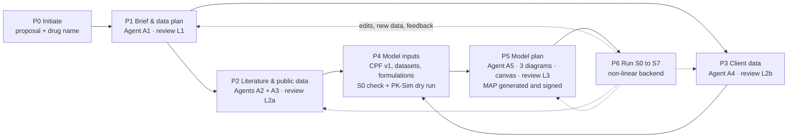
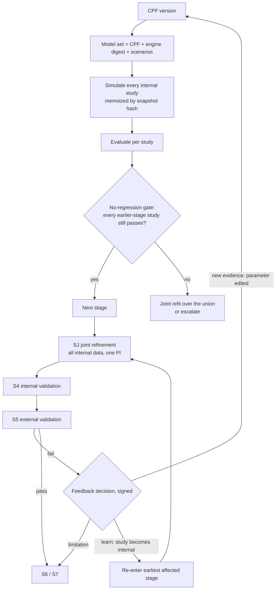

# Plan (DRAFT for review): the project start-up pipeline (P0–P6) and a non-linear model backend

| | |
|---|---|
| **Status** | **DRAFT v0.1, 2026-09-25. Nothing in this document is built yet.** It needs your answers to §19 and your approval before any code is written. |
| **Relation to the active plan** | `docs/plans/2026-09-24-s0-s7-real-pbpk.md` stays active for its remaining work (Phase 4: proof on published OSP models with real clinical data). This plan adds **project phases P0–P6** in front of MS-01 stage S0, and **Track N** (the non-linear backend) inside stages S1–S5. When approved, `docs/CONTINUATION_PACKAGE.md` §4.1 gains rows for P0–P5 and SJ. |
| **Naming** | **P0–P6** = project phases (this plan). **S0–S7** = MS-01 modeling stages (existing). **SJ** = the proposed joint-refinement stage. **D-xx** = a decision you make (§19). **R-xx** = your requirement (§2). **T-40+** = new task IDs for the trace matrix (T-01…T-32 exist). |
| **Your parallel session** | You said you will correct evaluation and the stage steps in another session. §12.7 defines the interface between that work and this plan so the two do not collide. |
| **SME-governed content** | Anything here that touches `rulesets/*.yaml`, acceptance criteria or MS-01 is a **proposal**. It changes only with your explicit approval, stays `UNVERIFIED`, and bumps the version (CLAUDE.md). Those items are marked **[SME]**. |
| **How to review** | Read §1 (one page), then §19 (decisions). Everything else is the detail behind them. Mark up the file or answer the D-numbers in chat. |

---

## 1. Summary

**The problem you named.** The engine runs, but the verdicts it shows are not evidence: the example campaigns were judged
against an illustrative IV profile and against profiles we simulated ourselves (known-truth tests). A model should pass
only when its predictions are compared with **real observed data** (client or literature), study by study, with the
prediction error shown. And the inputs themselves (compound parameters, observed data, the plan) are typed in as raw
JSON today, with no document intake, no literature work, no client Excel handling, no reviewable plan and no way to
edit an early decision later without starting over.

**What this plan builds.** A phase-gated, multi-agent start-up pipeline that becomes the beginning of every project:

```
P0 Initiate ─► P1 Brief & data plan ─► P2 Literature & public data ─┐
 (upload        (review layer 1)        (agent; review layer 2a)      ├─► P4 Model inputs ─► P5 Model plan ─► P6 Run S0–S7
  proposal,                            P3 Client data (Excel)        │   (PK-Sim building   (3 diagrams,     (existing engine,
  drug name)                            (agent; review layer 2b) ────┘    blocks, S0 check)  canvas; layer 3;  + non-linear
                                                                                             MAP signed)       backend)
```

- **Three review layers before anything runs** (R-03): L1 the Project Brief and data plan, L2 the evidence
  (literature and client data), L3 the model plan on the canvas. Each has a review page, edits, approval, version
  history, audit trail and source provenance.
- **Five agents plus deterministic code.** Agents read and propose; code checks, computes and decides; people approve.
  The orchestrator is code, not an LLM (§14.1).
- **Everything editable at any time** (R-10): every phase output is a versioned artifact in one project dependency
  graph. An edit makes a new version, shows what it affects before you save, and marks downstream work *stale*
  instead of deleting or silently recomputing it (§13).
- **Only real data can pass** (R-01): every dataset carries its origin; synthetic or illustrative data can never
  produce a PASS outside an exploratory project; a study without observed data is *not evaluable*, never a pass
  (§9.4).
- **Non-linear backend** (R-16): every CPF change re-simulates every internal study (no-regression gate); a
  **joint parameter identification** over all internal datasets (IV + oral + formulation + fed together) produces one
  consistent parameter set; an external-validation failure feeds back into the model through a documented
  learn-and-confirm cycle, and the influence map records which parameter change moved which study (§12).
- **Any drug, honestly** (R-13): the pipeline logic is drug-agnostic and driven by requirement templates; what the
  PK-Sim builder cannot represent yet is reported on day 1 by a feasibility check, never discovered at S3 (§7.5).

**What it reuses.** The literature agent, citation checker, MCP layer, data-mapping agent, Excel intake, CPF, split
algorithm, MAP generator, runner, PI spec builder (already multi-simulation) and signatures all exist (§4). Most of the
work is wiring, new schemas, four review pages, the canvas, and the non-linear control flow.

---

## 2. What you asked for (tick or correct each line)

| ID | Requirement as I understood it |
|---|---|
| R-01 | A model passes or fails only on **observed data**: predicted vs observed per study, with the prediction error shown. No verdict without real data. |
| R-02 | The current fold-based verdict display ("fold, fold, fold") is not how you want to judge. You want the data extracted and the prediction error judged. (Criterion form is D-03.) |
| R-03 | Two to three layers of review and editing **before** the pipeline runs. |
| R-04 | P0: the user uploads the technical proposal (PDF or Word), enters the drug name and any initial context. Nothing else. |
| R-05 | P1: an agent reads everything and extracts only what matters for PBPK/popPK modeling into a **fixed structure** (dose, route, plan, objective, what the client provides, what the client does not provide, what must come from the literature, etc.). A review page shows it; the user edits and approves. |
| R-06 | The PK-Sim inputs a project needs are defined **early and at a high level**, and every input stays within defined limits. |
| R-07 | P2: an agent gets every compound parameter from open literature, the way a literature-review scientist does; it **skips items the client will provide**; it also gets observed data: mostly in vitro data for disposition, and oral clinical data for external validation when needed; it records **exactly which source and which part** (page, table, figure). |
| R-08 | A review page for the literature results, with edit and approve. |
| R-09 | P3: the client delivers data in Excel (possibly several workbooks and sheets): RLD data, dissolution data, observed data for internal and external validation, and anything else the project needs. An agent reads all sheets, arranges the data (dissolution in particular) in the context of the project. |
| R-10 | Any part of the process can be edited at any moment (e.g., an updated technical proposal mid-project), and the consequences are handled. |
| R-11 | P4: the modeling tool has input pages that take everything gathered; the engine's own planning merges with the agent's planning. |
| R-12 | Three diagrams: disposition studied first, then absorption; a canvas where the whole plan is laid out and connected. |
| R-13 | Generic: any drug, any PBPK scenario, not only the drugs used so far; this applies to the engine too. |
| R-14 | P5: the user reviews the plan (which data trains, which validates internally, which validates externally, under which conditions, for which application, and why) as a DAG/tree on a canvas; the agent pre-plans; the user can drag and drop; later data changes can be placed there too. |
| R-15 | After the plan is approved, the engine follows it without change. |
| R-16 | Non-linear backend: when a later step (e.g., external validation) shows that a parameter must change, the change propagates to all data, including earlier fits and internal validation; every model is built from one parameter set, and all simulations and parameter identification use the same data. |
| R-17 | Multi-agent. |
| R-18 | Provenance per value and dataset: source type, exact source, extraction confidence, purpose (model building / internal / external validation), and whether it came from the client or the literature. |
| R-19 | Per phase: review page, edit, approve, version history, audit trail. |
| R-20 | You fix evaluation and stage steps in parallel; this plan must fit with that. |

---

## 3. How I read the unclear parts (proposed answers to your 20 questions)

Each row is my best reading. Confirm or correct; the plan changes where marked.

| # | Your phrase | My reading | Consequence in this plan |
|---|---|---|---|
| 1 | "folding, folding, folding" | The **fold-error** display: the monitor shows a GMFE gauge per round (`apps/web/components/FoldError.tsx`, `aucGmfe`/`cmaxGmfe` per round). Not k-fold cross-validation (the code has none). | §9.5: the primary result becomes a per-study observed vs predicted table with PE %; fold stays as a secondary column. Criterion form is D-03. |
| 2 | "results like 1424" | Probably a fold/GMFE value (e.g., 1.424) or a count shown on the monitor, for a campaign whose observed data were not real clinical data. | §9.4 real-data guard. **Please send a screenshot** so I can confirm what produced it. |
| 3 | "flexing the train" | "fits the training [data]": the example drug fits its training studies. | None. |
| 4 | "PKA SIM" | PK-Sim (OSP Suite; our engine is PK-Sim 12.3 via ospsuite 12.4.4). | All inputs map to PK-Sim building blocks (§7). |
| 5 | "BB modelling" | PBPK modeling. | None. |
| 6 | "H and everything" | "each and everything": every model (IV, oral, fed, validation, application) is generated from **one parameter set** (the CPF), and every fit uses the same data. | §12: model set, joint PI. |
| 7 | "PI" | **Parameter identification** (the PK-Sim term), not prediction interval. | §12.3 joint PI. If you meant prediction intervals: S6 already produces them. |
| 8 | "IV, hourly, fasted" | IV, **orally**, fasted: S1 IV done, S2 oral fasted done (and S3 fed). | §12.4 example. |
| 9 | "external radiation" | External validation. | §12.4. |
| 10 | "market pass" | "model pass". | §9. |
| 11 | "reference listed drug data" | **RLD** = the approved innovator product a generic is compared with (US Orange Book term; EU: reference medicinal product). RLD data = its label PK, BE-study reference-arm data, and RLD dissolution lots. | Projects can be generic/VBE projects: product roles TEST/RLD (§6, §10). |
| 12 | "dissolution" | In vitro dissolution profiles (% dissolved vs time) per product, strength, batch, medium, pH, apparatus, speed. Used to parameterize the PK-Sim formulation (Weibull or other release model), to compare TEST vs RLD (f2), and later for virtual BE. | §10.3. |
| 13 | fixed structured fields | Proposed in §6 (the Project Brief). | D-08. |
| 14 | acceptance criteria | Today: fold tiers by ICH M15 model risk (1.25 / 1.5 / 2-fold) in an UNVERIFIED ruleset. | D-03. |
| 15 | client file formats | `.xlsx`, `.xls`, `.csv`, multi-sheet. I also propose a standard client template (§10.2). | D-11. |
| 16 | "three diagram" | **D1** disposition map, **D2** absorption and formulation map, **D3** development and validation DAG (the drag-and-drop canvas). | §11. D-13. |
| 17 | "editing market date" | "anything that must be decided or edited, mark it": I read this as a request to list decisions explicitly. | §19 lists D-01…D-24. |
| 18 | codebase and engine | This repository: FastAPI + Next.js + file-backed single-node store; PK-Sim 12.3 on Linux via `run_job.R`. | §4. |
| 19 | all drugs? | Yes, by design; the engine's coverage grows by harvest; a feasibility check reports gaps per project. | §7.5. D-18. |
| 20 | who approves | Proposal in §16. | D-07. |

---

## 4. Where the code stands today (audit relevant to this request)

| Capability | Where | State | Gap for this plan |
|---|---|---|---|
| Create project | `services/api/.../write_api.py::create_project`, wizard step 1 (`apps/web/app/projects/new/page.tsx`) | Works: name, compound, one question. | No document upload, no brief, no data plan. |
| Compound parameters (CPF) | `packages/pbpk-domain/.../cpf/models.py` | Strong model: status, fit policy, plausibility, provenance, engine binding, uncertainty; immutable versions. | Entered as **raw JSON** in wizard step 2. `Provenance` has only `source_type`, `reference`, `run`: no DOI/page/quote/confidence/purpose. |
| Studies / observed data | `campaign/split.py::StudyRecord`; wizard step 3 (raw JSON); `components/DataIntake.tsx` (CSV paste + column mapping) | Works for one profile at a time. | No multi-sheet Excel in the UI; no dissolution ingestion; no RLD/TEST roles; no dataset origin (real vs synthetic). |
| Excel intake engine | `packages/data-intake` (`grid`, `recipe`, `apply`, `validate`, `vault`, `pksim`), `records.py` (`ConcentrationObservation`, `DissolutionObservation`) | Built and tested; raw vault by SHA-256; cell-level source refs; recipe fingerprints for reuse. | Not wired to the API or web. |
| Data-mapping agent | `services/agents/.../data_mapping.py` | Built: proposes a recipe with cell-quoted evidence; unknowns become questions. | Not wired; no sheet triage across many sheets; no reconciliation against what the client promised. |
| Literature agent | `services/agents/.../literature.py`, `parameter_curation.py`, `citations.py`, `mcp_servers.py` | Built: parameter proposals with verbatim-quote check, observed-study candidates, access requests for paywalled papers, MCP recording layer. | Not wired to the API or UI; MCP servers not deployed (T-22 not started); no input-document store (only a `DocumentStore` protocol); no PDF/DOCX text extraction for input documents. |
| Observed data from papers | F-503 (designed in `docs/ARCHITECTURE_PACK.md` §6.2); T-19 digitizer | **Not built.** | Needed for R-07. |
| Planning | `campaign/split.py` (MS-01 §3.3, deterministic), `campaign/map.py` (MAP, sign, revise/supersede) | Works. | No planner agent (F-502 designed only); no canvas; the user cannot change an assignment except by revising the MAP. |
| Stage loop | `services/orchestrator/.../local_runner.py` | S0 → S7 on real PK-Sim. | **Linear**: each stage fits only its own studies; earlier studies are not re-checked until S4; S5 failure offers only "limitation" or "stop" (§12.1). The designed `DEVIATION_PENDING` path (ENGINEERING_PLAN §4.3) is not built. |
| Joint fit machinery | `pbpk_domain/fit_spec.py::build_fit_spec` | Already fits one parameter jointly across several simulations (shared path). | Never used across stages. |
| Memoized runs | Designed (ENGINEERING_PLAN §4.1) | Not used in the single-node runner. | Needed for cheap propagation (§12.6). |
| Evaluation | `acceptance.py` (fold tiers, PE % per verdict), `campaign/evaluate.py` (NCA of each uploaded profile) | Works; per-study metrics exist in the round record. | UI leads with GMFE gauges; studies reporting only NCA values (no profile) cannot be used; no origin check. |
| Versioning / audit | CPF and MAP versions | Partial. | No generic artifact versions, no dependency graph, no staleness, **no audit trail in the single-node store** (Postgres `audit_events` exists but is not used). |
| Real data so far | `deploy/dev/read-root/dev/studies.json` | One illustrative IV profile; known-truth runs used synthetic profiles. | The OSP reference models in `services/engine-worker/golden/fixtures/` hold 362 real clinical datasets (S0–S7 plan Phase 4). |

---

## 5. The target workflow

### 5.1 Chronology and why this order



- **P2 and P3 run in parallel** (D-01). The data plan from P1 says who provides what, so the literature agent can start
  at once on literature items while the client prepares files. Waiting for the client first would idle the project;
  searching the literature for what the client will send wastes effort (your rule R-07). P4 joins both and reconciles.
- **P4 before P5**: the plan needs to know which data actually exist (with n, time points, statistic) and whether the
  model can be built (S0 completeness, PK-Sim dry run). Planning on promised data would plan on fiction.
- **Dashed arrows are the edit and feedback paths** (§13, §12.4): an edit re-opens a phase as a new version;
  nothing downstream is deleted, it is marked stale with a reason.

### 5.2 Phase specifications

Every phase has the same shape: **inputs → worker (agent or code) → artifact (versioned) → review page → gate**.

#### P0 · Initiate
| | |
|---|---|
| Inputs | Technical proposal (PDF/DOCX, one or more files, e.g., proposal + annexes); drug name (INN or code); optional free text (context, client name, deadline); optional project archetype (§7.4). |
| Worker | Code: stores each file in the raw vault by SHA-256 (`modeler_intake.vault`), extracts text per page (§15.5), creates project `DRAFT`. Starts A1. |
| Artifact | `Document` (immutable, hashed), `Project` v1. |
| Page | `/projects/new` (replaces wizard steps 1–3). One screen: drop zone, drug name, context, Start. |
| Gate | None. |

#### P1 · Brief & data plan (review layer L1)
| | |
|---|---|
| Inputs | P0 documents, drug name. |
| Worker | **A1 Proposal Intake Agent** fills the fixed Project Brief (§6); every value cites document, page and verbatim quote, or stays `MISSING` with a question. Drug identity (SMILES, InChIKey, MW) is resolved from PubChem and cross-checked. Code then **derives the data plan**: the requirement matrix (§7), each item with provider (CLIENT / LITERATURE / PREDICT / NOT NEEDED), purpose and due date; and runs the **feasibility check** (§7.5). |
| Artifacts | `ProjectBrief` vN, `RequirementMatrix` vN, `FeasibilityReport`. |
| Page | `/projects/[id]/brief` with tabs *Brief* · *Data plan* · *Feasibility* · *Questions* (§15.6). |
| Gate | Brief approved (signature meaning "Reviewed", D-07). The data plan is approved on the same page; after that, P2 and P3 start. |

#### P2 · Literature and public data (review layer L2a)
| | |
|---|---|
| Inputs | Approved Brief; requirement items with provider LITERATURE (or PREDICT with a literature cross-check); observed-data needs not covered by the client (§7.3). |
| Worker | **A2 Literature Parameter Agent** (extends the existing `literature.py`): values with conditions, citations, conflicts, coverage report, access requests. **A3 Observed Data Agent** (new, F-503): clinical PK studies and in vitro data, extracted from tables verbatim or from figures by the digitizer with human axis calibration (§9.2). |
| Artifacts | `EvidenceItem`s (PROPOSED → ACCEPTED/REJECTED), `ObservedDataset` drafts, `AccessRequest`s, `CoverageReport`. |
| Page | `/projects/[id]/evidence` tabs *Parameters* · *Observed data* · *Conflicts* · *Access requests* · *Coverage*. |
| Gate | Every REQUIRED literature item is ACCEPTED, marked NOT AVAILABLE (with the consequence shown), or re-routed; phase approved (signature "Reviewed"). |

#### P3 · Client data (review layer L2b)
| | |
|---|---|
| Inputs | Client workbooks (any number, any time); the approved data plan (what the client promised). |
| Worker | Code reads the workbook grid; if it matches the client template or a confirmed recipe fingerprint, it is read without AI. Otherwise **A4 Client Data Agent** triages every sheet, proposes mapping recipes with cell evidence, and reconciles the delivery against the promise (delivered / partial / missing / unexpected). Code arranges dissolution data, computes f2 where applicable and fits the release model (§10.3). |
| Artifacts | `ClientSubmission` (files + recipes), `ObservedDataset`s (origin CLIENT), `DissolutionProfile`s, `EvidenceItem`s for client-measured parameters, `ReconciliationReport`. |
| Page | `/projects/[id]/client-data` tabs *Files* · *Sheets & mapping* · *Reconciliation* · *Dissolution* · *Products (TEST/RLD)*. |
| Gate | Each recipe confirmed by a reviewer (existing rule); reconciliation reviewed; missing promised items either re-routed to literature (D-02) or recorded as a limitation. Phase approved. |

#### P4 · Model inputs (the PK-Sim input pages)
| | |
|---|---|
| Inputs | Accepted evidence (P2 + P3), datasets, dissolution fits, the Brief's scenarios. |
| Worker | Code assembles **CPF v1** (each record from an accepted evidence item, provenance carried into PK-Sim `ValueOrigin`), the **study catalog** (`StudyRecord` per dataset), the **formulation set**, individuals/populations from study demographics, protocols, meal events. Then S0 checks (completeness, expression profiles, units, bindings) and a **PK-Sim dry run**: every planned simulation is built and loaded in the engine without running it. |
| Artifacts | `CPF` v1, `StudyCatalog` vN, `ReadinessReport` (S0 + dry run). |
| Page | `/projects/[id]/inputs`, tabs mirroring PK-Sim building blocks: *Individuals* · *Populations* · *Compound* · *Formulations* · *Protocols* · *Events* · *Observed data* · *Simulation settings*. Every field shows value, PK-Sim unit, status (FIXED / PREDICTED / FITTABLE@Sx with bounds / MISSING), and a provenance chip that opens the source at the quoted span. |
| Gate | S0 readiness passes (or each failure is routed back to P2/P3); no signature (the MAP signature in P5 covers it). |

#### P5 · Model plan (review layer L3)
| | |
|---|---|
| Inputs | CPF v1, study catalog, Brief (question, context of use, applications, criteria), feasibility. |
| Worker | Code first computes the **default plan** from MS-01 (split §3.3, stage plan, fit candidates, budgets) exactly as `generate_map` does today. **A5 Planning Agent** then drafts the model structure choices and explains every assignment; it may propose departures from the default only with a reason, shown as a diff. |
| Artifacts | `ModelPlan` vN (assignments, structure choices, rationale, canvas layout); on approval the **MAP** is generated from it deterministically and signed (existing signature flow). |
| Page | `/projects/[id]/plan`: three diagrams (D1 disposition, D2 absorption and formulation, D3 development and validation DAG) with a side panel listing all datasets ("overall data"); drag and drop on D3 (§11). |
| Gate | Live validator green (no rule violations); MAP signed (MIDD lead, D-07). |

#### P6 · Run (S0 → S7, existing engine plus Track N)
| | |
|---|---|
| Inputs | Signed MAP, CPF v1, observed data. |
| Worker | Existing runner, extended by the non-linear backend (§12): no-regression gate after each fitting stage, joint refinement SJ, external-validation feedback cycles, influence map, memoized re-runs. |
| Artifacts | Campaign, `ModelSet`s, rounds, evaluations, influence map, change ledger, S6 prediction, S7 package. |
| Page | Existing monitor, plus *Model set* header, regression table, cycle timeline, influence heat map, feedback decision card. |
| Gate | Existing: escalations, S4/S5 signature before S6, reproduction gate before export. New: feedback decisions (§12.4) are signed. |

---

## 6. The fixed project structure: the Project Brief

One schema for every project (R-05). Sections that do not apply are marked `NOT_APPLICABLE` by the reviewer, never
deleted, so every brief can be compared field by field. Frozen pydantic model, versioned, JSON Schema exported like the
CPF's (`packages/project-model/schemas/brief.schema.json`, §15.1).

**Every field is a record**, not a bare value:

```json
{
  "field": "dose.regimens[0].dose",
  "value": 50, "unit": "mg",
  "status": "EXTRACTED",
  "citations": [{"doc_sha256": "9f2c…", "page": 4, "locator": "Table 2", "quote": "single oral dose of 50 mg"}],
  "confidence": "A",
  "note": "",
  "edited_by": null, "edited_at": null
}
```

`status` ∈ `EXTRACTED` (stated in the document, quote verified) · `RETRIEVED` (from a database record, e.g. PubChem,
record cited) · `EDITED` (changed by a person, reason required) · `CONFIRMED` (reviewed unchanged) · `MISSING`
(not stated; a question is raised) · `NOT_APPLICABLE`. The agent may **not** infer a value without a citation: what the
document does not say is `MISSING` plus a question, never a guess (same rule as the existing data-mapping agent).

| § | Section | Fields (id: meaning) | Feeds |
|---|---|---|---|
| A | Project | `proj.title`; `proj.client` (confidential); `proj.proposal_docs[]` (sha, version, date); `proj.type` (new drug IND / NDA / 505(b)(2) / generic ANDA / biowaiver / lifecycle change / research; EU and other agencies' equivalents) [VERIFY list with you]; `proj.agencies[]` (FDA, EMA, PMDA, CDSCO, other); `proj.deliverables[]` (model files, MAR, M15 table, report, VBE results, slides); `proj.milestones[]` (name, date) | archetype (§7.4), report |
| B | Drug substance | `drug.name` (INN), `drug.code`, `drug.synonyms[]`, `drug.salt_form`, `drug.dose_basis` (salt or free base), `drug.cas`, `drug.pubchem_cid`, `drug.smiles`, `drug.inchikey`, `drug.mw_free_base`, `drug.mw_salt`, `drug.modality` (small molecule / large molecule / other), `drug.bcs_class` (as stated), `drug.bddcs_class`, `drug.therapeutic_area` | CPF identity rows, MW check, feasibility |
| C | Products | `products[]`: name, **role** (TEST / RLD / REFERENCE / SOLUTION / OTHER), dosage form, strengths, release type (IR / DR / ER), manufacturer, planned batches, stated attributes (particle size, polymorph, key excipients) | formulations, dissolution, VBE |
| D | Question and context of use (ICH M15) | `qoi.text`; `qoi.context_of_use`; `qoi.decision` (what the model result will decide); `qoi.applications[]` (APP-01…APP-19, `docs/ARCHITECTURE_PACK.md` §2.2); `m15.influence`, `m15.consequence`, `m15.risk`, `m15.impact` (description extracted; **ratings are human-only**, existing rule); `acceptance.stated` (criteria text as written in the proposal); `acceptance.tier` (derived, human-confirmed) | MAP, acceptance tier, S6 templates |
| E | Scenarios to simulate | `scenarios[]`: population, route, dose and unit, regimen (SD/MD, interval, number of doses, infusion time), product, food state and meal, co-medication, outputs of interest (plasma AUC, Cmax, Ctrough, tissue, urine), virtual trial design (n, crossover/parallel) | S6 applications, requirement matrix |
| F | Populations | `populations[]`: healthy / patient, age range or pediatric bins, sex, ethnicity (PK-Sim population name resolved from the harvested list, §7.5), organ impairment class (Child-Pugh, eGFR band), pregnancy, genotype/phenotype; `species[]` for preclinical | individuals, populations, VPC |
| G | Model scope | `scope.platform` (PK-Sim version); `scope.model_type` (PK-Sim small-molecule or large-molecule model; internal names from harvest); `scope.parent_metabolite`; `scope.pathways_stated[]` (enzymes with fm if stated, transporters, renal, biliary); `scope.nonlinearity` (stated saturation, auto-induction); `scope.ddi` (victim/perpetrator, partners); `scope.ehc`; `scope.pd` | D1 diagram, requirement matrix, feasibility |
| H | **Data plan (responsibility statements)** | `data[]`: item as stated, **provider** (CLIENT / LITERATURE / SPONSOR_TO_MEASURE / NOT_STATED), **purpose** (model building / internal validation / external validation / application verification / supportive), due date, expected format, quote | requirement matrix providers, P2/P3 scope, reconciliation |
| I | Assumptions, exclusions, risks | as stated, each cited | MAP, MAR limitations |
| J | Open questions | generated by A1 and by the validator; each answered or accepted as a limitation | review |

---

## 7. PK-Sim input requirements and the data-responsibility matrix

This is R-06: *"whatever PK-Sim asks for, we define early, and every input stays within the defined limit."*

### 7.1 The requirement item

A **requirement template** is versioned YAML (`packages/pbpk-domain/src/pbpk_domain/requirements/*.yaml`, status
`UNVERIFIED` until SME sign-off, like the other rulesets **[SME]**). Deriving the matrix is deterministic code: template
+ Brief → one `RequirementItem` per needed input.

| Field | Meaning |
|---|---|
| `req_id` | Stable id, e.g. `REQ-bind.fu`, `REQ-obs.iv_sd` |
| `target` | A CPF id from MS-01 §2.2 (e.g. `bind.fu`), a dataset class (e.g. `IV-SD`), or a formulation input (e.g. `dissolution:{product}`) |
| `pksim` | Building block and parameter **as harvested** (`services/engine-worker/golden/catalog.json`) or `TO HARVEST` when not in the catalog yet. Never typed by hand. |
| `unit` / `dimension` | The unit PK-Sim stores (MS-01 §2.2) and its OSP dimension; any other unit is converted by `pbpk_domain.units` with the conversion recorded |
| `criticality` | REQUIRED (S0 blocks without it) · CONDITIONAL (with its condition, e.g. "BCS II/IV or dissolution-limited") · OPTIONAL |
| `needed_for` | Stages and applications (e.g. S1, S2, APP-12) |
| `provider` | From the Brief's data plan: CLIENT · LITERATURE · PREDICT (in silico, flagged PREDICTED) · NOT_NEEDED; editable at review |
| `purpose` | model building · internal validation · external validation · application verification |
| `plausibility` | Range from the CPF plausibility defaults **[SME]**; any value outside is blocked for review, never silently accepted |
| `conditions_schema` | What must be recorded with the value (see §8.2), e.g. for CLint: system, protein concentration, fu,inc |
| `source_preference` | Ordered source classes (§8.3) |
| `status` | OPEN · IN_PROGRESS · SATISFIED (by evidence ids) · NOT_AVAILABLE (with consequence) · WAIVED (reason) |

### 7.2 Core template: small molecule, IV and/or oral (APP-01)

Rows use MS-01 §2.2 ids and PK-Sim locations as already recorded there. Criticality follows the S0 completeness rule.

| Group | CPF id | PK-Sim location (MS-01 §2.2) | Unit | Criticality | Usual provider | Conditions to record |
|---|---|---|---|---|---|---|
| Identity | `id.name`, `id.smiles`, `id.inchikey` | Compound name | – | REQUIRED | Brief / PubChem | salt vs free base |
| Phys-chem | `phys.mw` | Compound `Molecular weight` | g/mol | REQUIRED | structure | free base |
| | `phys.halogens.{F,Cl,Br,I}` | Compound `F`,`Cl`,`Br`,`I` | count | REQUIRED if present | structure | |
| | `phys.logp` | Lipophilicity alternative | Log Units | REQUIRED | literature (measured) / predicted | logP vs logD and pH, method |
| | `phys.pka[i]` | `PkaTypes` | – | REQUIRED or "neutral" | literature | acid/base, method, predicted flag |
| | `phys.solubility.ref` (+ `ref_ph`) | Solubility alternative | mg/ml | REQUIRED | client or literature | medium, pH, temperature, solid form |
| | `phys.solubility.table` | Solubility table alternative | mg/ml vs pH | CONDITIONAL (ionizable, BCS II/IV) | client | per pH, buffer |
| Binding | `bind.fu` | FractionUnbound | – | REQUIRED | literature / client | species, method, drug concentration |
| | `bind.partner` | PlasmaProteinBindingPartner | enum | OPTIONAL (needed for special populations) | literature | |
| Distribution | `dist.bp_ratio` | Blood/Plasma ratio | – | CONDITIONAL | literature | hematocrit |
| | `dist.partition_method`, `dist.permeability_method` | CalculationMethods | enum | defaults (R&R, PK-Sim Standard) | plan | branch candidates |
| Permeability | `perm.intestinal` | Specific intestinal permeability | cm/min | CONDITIONAL (oral) | calculated / Caco-2 IVIVC | cell line, direction, IVIVC used |
| | `perm.cellular` | Permeability | cm/min | calculated | PK-Sim | |
| Elimination | `elim.hepatic.{enzyme}.clspec` | `MetabolizationSpecific_FirstOrder` | l/µmol/min | one pathway REQUIRED | literature (CLint → IVIVE) | system, protein conc., fu,inc, scaling factors |
| | `elim.hepatic.{enzyme}.km/vmax` | `MetabolizationSpecific_MM` | µmol/l, µmol/l/min | CONDITIONAL (nonlinearity) | literature | as above |
| | `elim.fm.{enzyme}` | constraint | fraction | CONDITIONAL (DDI, PGx) | literature (clinical) | evidence type |
| | `elim.renal.gfr_fraction` | `GlomerularFiltration` | – | CONDITIONAL (renal) | default 1; fit with urine data | fe source |
| | `elim.renal.ts_clspec`, `elim.biliary.cl`, `elim.hepatic.total_cl` | TO HARVEST (T-10 tail) | – | CONDITIONAL | literature | |
| Transport | `transp.{t}.{km,vmax,clspec}` | `ActiveTransportSpecific_MM` | – | CONDITIONAL | literature | direction, system |
| Expression | per enzyme/transporter | expression profile (harvested library, 16 proteins) | – | REQUIRED per named protein | library | missing profile = S0 failure |
| Formulation | `form.{name}.type`, `.weibull.{t50,shape,lag}` | `Formulation_Dissolved` / `Formulation_Tablet_Weibull` | min, –, min | REQUIRED per solid product | client dissolution → fit (§10.3) | medium, apparatus, batch |
| Food | `food.fed_solubility_factor` | TO HARVEST | – | CONDITIONAL (fed, no measured FeSSIF) | client / literature | FeSSIF/FaSSIF |
| System | individual, population | `OriginData` (Species, Population, Gender, Age) | – | REQUIRED per study | study demographics | weight/height recorded, not yet emitted (known gap) |
| Protocol | dose, route, schedule, infusion time | Protocol building block | – | REQUIRED per study | study | salt vs base |
| Events | meal | `Meal: High-fat breakfast (Human)`, `Meal: Standard (Human)` (harvested) | – | CONDITIONAL (fed) | study | meal composition |

### 7.3 Observed-data requirements (from MS-01 §3.3)

The same matrix lists the **data** the plan needs, with the purpose written on each row, so the literature agent knows
what to look for and the client knows what is expected.

| req_id | Need | Purpose | Rule |
|---|---|---|---|
| `REQ-obs.iv_sd` | ≥ 1 IV single-dose study, healthy adults | S1 training (disposition) | MS-01 §3.3 rule 1; absent → decision tree §6.1 |
| `REQ-obs.po_fasted_range` | Fasted oral SD (solution or IR) at the lowest and highest dose | S2 training | rule 1 |
| `REQ-obs.dissolution` | Dissolution per solid formulation | S3 (formulation) | rule 1 |
| `REQ-obs.fed` | ≥ 1 fed study (only if a fed parameter is fitted) + ≥ 1 more for external | S3 fed / S5 fed | rule 5 |
| `REQ-obs.external_*` | ≥ 1 each, when the class exists: fasted, fed, multiple dose, other dose level, other formulation | S5 external validation | rule 3 |
| `REQ-obs.urine` | fe or urine profile | renal fit permission | MS-01 §2.2 (`elim.renal.*` fit only with urine/fe) |
| `REQ-obs.app_*` | Clinical DDI / pediatric / organ-impairment studies | S6 application verification | rule 4 (never trained in S1–S3) |

**Provider logic (R-07).** Each row takes its provider from the Brief's data plan. CLIENT rows are **not searched**
(D-02 asks whether a light cross-check is wanted). A CLIENT row still open at its due date is flagged; re-routing it to
LITERATURE is one click with a reason, recorded as a data-plan edit.

### 7.4 Templates per application archetype (deltas to §7.2/§7.3)

| Archetype | Adds | Notes |
|---|---|---|
| APP-01 build and verify | – (the core) | |
| APP-11/14 formulation, VBE, dissolution safe space (generic / RLD) | TEST and RLD products; dissolution for both in the same media; BE-study data (reference arm at least); intra-/inter-subject variability estimates; BE criteria (80–125 %, 90 % CI) | `pbpk_domain.bioequivalence` exists; the VBE application template is T-31 |
| APP-12 food effect | fed and fasted studies; meal composition; FeSSIF/FaSSIF solubility | MS-01 rule 5: if food effect is the question, fed studies are all external |
| APP-03/04 DDI | fm per pathway with clinical support; in vitro Ki,u / kinact,KI / EC50,Emax; perpetrator models (OSP library) | MS-01 §6.10 |
| APP-06 pediatric | adult verified model; ontogeny for every named protein; pediatric data if any | populations harvested: `Preterm` etc. |
| APP-07/08 organ impairment | Child-Pugh / eGFR physiology set | [VERIFY] PK-Sim disease states per version |
| APP-02 FIH | species CPF variants; in vitro CLint per species; preclinical PK | MS-01 §6.8 |

### 7.5 Feasibility check: what "any drug in the world" means today

The pipeline itself is drug-agnostic: nothing in P0–P6 knows a drug by name. What limits a project is what the PK-Sim
builder can produce. The **feasibility check** (P1, repeated at P4) compares the Brief's scope with the builder's
capabilities and the harvested catalog, and reports on day 1 instead of failing at S3.

| Model feature | Status today | Source |
|---|---|---|
| Small molecule, IV bolus / infusion, oral | **Supported** | builder, verified on PK-Sim |
| Oral solution, IR tablet/capsule with Weibull release | **Supported** | `Formulation_Dissolved`, `Formulation_Tablet_Weibull` harvested |
| Particle dissolution, Lint80, Table, zero/first-order release | **Needs harvest** (T-10 tail) | not in the four reference models |
| First-order and Michaelis-Menten metabolism, transporters, GFR, inhibition, induction, specific binding | **Supported** | catalog: 9 process types |
| `MetabolizationLiverMicrosomes_MM`, `rCYP450_MM` | In catalog, **not in builder** | T-10 tail |
| Total hepatic, biliary, tubular-secretion clearance | **Needs harvest** | T-10 tail |
| Multiple dose (regular schedule), meals | **Supported** (`DI_24`, `DI_12_12`, two meal templates) | harvested |
| Populations: 8 human (incl. `Pregnant`, `Preterm`), species Beagle/Dog/Minipig/Monkey/Mouse/Rabbit/Rat | Catalog **yes**; population block in builder **partial** | T-10 |
| Metabolites (parent-metabolite) | **Not supported** (MS-01 v1.0 fits parent only) | MS-01 §6.5 |
| Large molecules (PK-Sim large-molecule model) | **Needs harvest + builder** | [VERIFY] model names |
| Other routes (subcutaneous, dermal, inhalation, intramuscular, ...) | **Not supported**; several need MoBi extensions | [VERIFY] per PK-Sim version |
| PK/PD | **Not supported** (MS-01 §6.9) | |

Each unsupported feature the Brief needs appears as a blocking or limiting line with its route to support (harvest a
reference model, extend the builder, or MoBi). Coverage grows by adding harvested reference models, never by typing
names (CLAUDE.md rule).

---

## 8. Evidence, provenance and confidence (R-18)

### 8.1 The evidence item

Every value and every dataset that can enter a model is an `EvidenceItem`, versioned, in state PROPOSED → ACCEPTED /
REJECTED / SUPERSEDED. It extends today's `ParameterProposal` and the CPF `Provenance`.

| Field | Content |
|---|---|
| `target` | CPF id or dataset id; `req_id` it satisfies |
| `value`, `unit` (as stated), `value_pksim`, `unit_pksim` | Original and converted; the conversion (factor, MW used) is stored |
| `source_type` | `CLIENT_REPORT` · `CLIENT_FILE` · `REGULATORY_REVIEW` (FDA/EMA) · `PUBLICATION` · `DATABASE` · `OSP_LIBRARY` · `PROPOSAL` · `PREDICTED` · `ASSUMPTION` |
| `source` | DOI, PMID, URL, file SHA-256, sheet and cells, page, table/figure id, retrieved-record hash |
| `quote` | Verbatim span (checked by `citations.quote_appears_in`); for cells, the cell text |
| `extraction` | `TEXT` · `TABLE` · `FIGURE_DIGITIZED` · `CELL` · `COMPUTED` (e.g. IVIVE, Weibull fit, with inputs and function version) |
| `conditions` | Structured per parameter type (§8.2) |
| `confidence` | A–D (§8.4), with the flags that set it |
| `purpose` | model building · internal validation · external validation · application · supportive |
| `provider` | CLIENT or LITERATURE (and who at the client, if stated) |
| `decision` | accepted/rejected by, when, reason; edits carry a reason |
| `pksim_value_origin` | What is written into PK-Sim's `ValueOrigin` (Source from the harvested enum only, Method, Description = citation + locator + confidence). A raw label once made PK-Sim drop a simulation (fix 6de102d); the mapping is a tested table. |

### 8.2 Conditions that must travel with a value (examples)

| Parameter | Required conditions |
|---|---|
| fu | species, matrix (plasma/serum), method (equilibrium dialysis, ultrafiltration, ...), drug concentration, temperature |
| logP / logD | logP or logD, pH, method (shake flask, HPLC), measured or predicted |
| pKa | acid/base, method, measured or predicted |
| Solubility | medium (water, buffer, FaSSIF, FeSSIF), pH, temperature, solid form (salt, polymorph), time |
| CLint | system (HLM, hepatocytes, rCYP), protein or cell concentration, fu,inc (measured or predicted), substrate concentration vs Km, units per mg protein or per million cells, scaling factors used |
| Km / Vmax | system, fu,inc, units |
| Caco-2 / Papp | cell line, direction (A→B), pH gradient, inhibitors, IVIVC equation used |
| B:P | species, hematocrit, concentration |
| Ki / kinact / EC50 | system, fu,inc, probe substrate, pre-incubation |
| Clinical PK | population, n, dose, route, formulation, food, statistic (arithmetic/geometric mean, median), variability type, LLOQ, analyte, matrix |

A value missing a required condition is accepted only with a reviewer note; its confidence drops one grade.

### 8.3 Source preference (default, **[SME]**)

1. Regulatory review documents (FDA clinical pharmacology / biopharmaceutics reviews, EMA assessment reports).
2. Peer-reviewed primary publications with measured data.
3. Client study reports (for CLIENT rows these come first).
4. Published, qualified PBPK models (OSP model library parameter tables with their own citations: the primary source is
   then followed and cited, the model is the pointer).
5. Curated databases citing a primary source (ChEMBL, PubChem, PK-DB).
6. Computed values (predicted logP, pKa): only when nothing measured exists, always `PREDICTED`.

General web pages may be used to **find** primary sources, never as the source of a value (D-09). DrugBank's license
restricts commercial use **[VERIFY]**; excluded unless you hold a license.

### 8.4 Confidence grades (deterministic first, reviewer may override with a reason)

| Grade | Rule |
|---|---|
| **A** | Measured; human (or the project species); primary source; required conditions present and matching PK-Sim's meaning; quote contains the value |
| **B** | Measured, but secondary source, or conditions partly matching (e.g., fu at a non-therapeutic concentration), or conversion needed an assumption |
| **C** | Predicted/computed, IVIVE-derived, digitized from a figure, or a different species scaled |
| **D** | Assumption, default or expert judgment |

Flags shown next to the grade: `value_not_in_quote` (existing check), `species_mismatch`, `conflict>2-fold` with another
item, `outside_plausibility`, `condition_missing`. Conflicting values are shown side by side and never averaged
(existing agent policy).

---

## 9. Observed data: getting real data, and the rule that only real data can pass (R-01, R-07)

### 9.1 Where real observed data come from

| Source | What it gives | Access |
|---|---|---|
| Client files (P3) | Individual or summary concentration-time data, NCA tables, dissolution | Excel intake |
| FDA / EMA review documents | Mean profiles (figures), PK parameter tables | public PDFs; BioMCP covers Drugs@FDA/OpenFDA metadata |
| Primary publications | Tables, figures | Europe PMC open-access full text; paywalled → access request (existing) |
| OSP model library | Published observed datasets with study metadata (362 in our four fixtures) | GitHub; license per model **[VERIFY]** |
| PK-DB (pk-db.com) | Curated concentration-time data with study metadata | open database **[VERIFY license and API]** |
| ClinicalTrials.gov | Study design, sometimes results tables | public API via BioMCP |

### 9.2 Extraction methods

- **Tables** (text): the agent proposes rows; each row's numbers must appear verbatim on the cited page (existing quote
  check extended to table rows); units and statistic must be stated on the page or it is a question.
- **Figures**: deterministic digitizer (T-19, now required): the page image is shown; **a person sets the axis
  calibration** (two points per axis, linear or log); the tool extracts marker centers per series; the overlay (extracted
  points drawn over the figure) must be approved. Error-bar ends are digitized as SD/SE with the type stated by the
  source. The dataset is tagged `FIGURE_DIGITIZED` with the calibration and an estimated digitization error.
- **PK parameters only** (many papers report only AUC/Cmax tables): stored as a *PK-parameter dataset*. It can judge a
  prediction (validation) but cannot drive a profile fit. This needs a small change in the evaluation input
  (`campaign:prepare` derives observed PK only from profiles today): part of the §12.7 contract.
- **Reported vs recomputed**: when both a profile and reported NCA exist, our NCA of the profile is compared with the
  reported values; a difference > 20 % **[SME]** is flagged (usually a digitization or unit problem).

### 9.3 In vitro data (your "in vitro data for disposition kinetics")

I read this as in vitro ADME **parameters** (CLint in microsomes/hepatocytes, fu, B:P, Caco-2 Papp, Km/Vmax, Ki), which
are evidence items in P2, converted by deterministic IVIVE into CPF values (`elim.hepatic.*.clspec` etc.), with every
scaling factor recorded. If you meant in vitro **time-course** data (e.g., microsomal depletion curves) that we should
fit, say so (D-23): that is a separate deterministic fit before IVIVE.

### 9.4 The real-data rule (answers "without any data we completed results")

Every dataset carries `origin` ∈ `CLIENT` · `LITERATURE` · `FIGURE_DIGITIZED` · `OSP_LIBRARY` · `SYNTHETIC` ·
`ILLUSTRATIVE`.

1. A study with no observed data is **NOT_EVALUABLE**. It can never count toward a pass.
2. `SYNTHETIC` and `ILLUSTRATIVE` data can run the pipeline (machinery tests, demos) but the verdict is shown as
   **"TEST ONLY: no real observed data"** and cannot pass a gate in a non-exploratory project (D-19).
3. The monitor and the MAR state, per stage, how many judged studies are real and from which origin.
4. The example project's illustrative IV profile is relabeled `ILLUSTRATIVE` in the same change.

### 9.5 How a result is shown (the "fold, fold, fold" complaint)

Per study, per stage, the first thing on screen:

| Study | Origin | Metric | Observed (source) | Predicted | Pred/Obs | PE % | Criterion | Verdict |
|---|---|---|---|---|---|---|---|---|
| iv-250 | CLIENT | AUC0–t | … (NCA of profile) | … | … | … | per MAP | PASS/FAIL |
| | | Cmax | … | … | … | … | per MAP | |
| | | tmax, t½ | … | … | … | … | flag only | |

Below it: the concentration-time overlay (observed points with error bars, prediction, VPC band where run), and the
profile-level fit (AAFE, share of points within 2-fold). The GMFE gauge stays as a summary, not as the verdict. The
criterion itself (fold tiers, symmetric PE %, or criteria written in the proposal) is D-03 and is SME-governed.

---

## 10. Client data (Excel) and dissolution (R-09)

### 10.1 Reading any workbook

1. **Vault**: stored as uploaded, by SHA-256, write-once (exists).
2. **Grid**: every sheet read with `Sheet!A1` references; merged headers expanded (exists).
3. **Triage** (new, A4): each sheet classified as `PK_INDIVIDUAL`, `PK_SUMMARY`, `PK_PARAMETERS`, `DISSOLUTION`,
   `PRODUCT_INFO` (TEST/RLD), `DEMOGRAPHICS`, `BIOANALYTICAL` (LLOQ, method), `PHYSCHEM_INVITRO`, `URINE_FECES`,
   `OTHER` with a quoted header as evidence.
4. **Recipe** per table (exists): which rows are data, columns, units, LLOQ, dose, study id, each with a cell quote;
   gaps become questions. A confirmed recipe is fingerprinted and re-used without AI next time (exists).
5. **Apply and validate** (exists): BLQ tokens, decimal commas only when declared, unit checks, time order, duplicates,
   mean without N, dissolution outside 0–110 %.
6. **Reconcile** (new): each record is linked to a requirement item; the report lists promised-and-delivered,
   promised-and-missing, partial (e.g., dissolution in 2 of 3 promised media), and delivered-but-not-promised.
7. **Link to the Brief**: products (TEST/RLD), doses and studies are matched to Brief sections C and E; mismatches (a
   dose the proposal never mentioned) become questions.

### 10.2 A client template (recommended, D-11)

`templates/client-data/ModelerOne_ClientData_v1.xlsx`: a file read with no AI and no ambiguity. Sheets:

| Sheet | Columns (abridged) |
|---|---|
| README | how to fill; units allowed; BLQ convention |
| Studies | study_id, reference, design (SD/MD; crossover/parallel), population, special population, n, age mean/min/max, weight mean, % female, ethnicity, genotype, co-medication, route, dose, dose unit, salt/base, infusion duration, product, product role (TEST/RLD/SOLUTION), strength, batch, food state, meal (type, kcal, fat g), dosing interval, n doses, analyte, matrix, LLOQ, LLOQ unit, intended use as planned |
| PK_Individual | study_id, subject_id, period, treatment, nominal time, actual time, time unit, concentration, unit, BLQ flag |
| PK_Summary | study_id, treatment, time, time unit, statistic (arithmetic mean / geometric mean / median), value, variability (SD / CV % / SE), n, unit |
| PK_Parameters | study_id, treatment, parameter (AUC0–t, AUCinf, Cmax, tmax, t½, CL/F, Vz/F), statistic, value, variability, unit |
| Dissolution | product, role (TEST/RLD), strength, batch/lot, apparatus, rpm, medium, pH, volume ml, temperature, surfactant, time, time unit, vessel_1 … vessel_12 or mean/SD/n |
| Product | product, role, dosage form, strength, release type, particle size D10/D50/D90 and method, polymorph, salt form |
| Physchem_InVitro | parameter, value, unit, conditions, method, report reference |
| Urine_Feces | study_id, interval start/end, amount or fraction excreted, unit |

Non-template files are still accepted through A4 (step 3–5 above).

### 10.3 Dissolution arrangement

- **Canonical profile**: product × role × strength × batch × apparatus × rpm × medium × pH × volume → times, per-vessel
  values, mean, SD, CV, n; source cells kept.
- **Checks**: t = 0 → 0 %; ≤ 110 %; plateau detection; CV per time point (for f2 applicability); units of time.
- **f2 TEST vs RLD** per medium, computed deterministically only when the applicability conditions hold (number of
  vessels, CV limits, points after 85 %); otherwise reported "f2 not applicable" with the reason. The exact conditions
  come from the FDA/EMA dissolution guidances and are ruleset data **[SME][VERIFY]**.
- **Release model fit** (MS-01 S3, "deterministic least squares, no engine"): Weibull fitted in **PK-Sim's own
  parameterization** (`Dissolution time (50% dissolved)`, `Dissolution shape`, `Lag time`) per profile, with SEs; the
  PK-Sim Weibull equation is confirmed against an engine run before first use (harvest rule). A profile that plateaus
  well below 100 % cannot be represented by Weibull; it is routed to a Table formulation (needs harvest, §7.5).
- **Which profile represents in vivo release** (biorelevant vs QC medium, one batch vs pooled) is a planning decision
  proposed by A5 and signed in the MAP (D-12).
- Output: `form.{name}.weibull.*` evidence items (extraction `COMPUTED`, inputs and function version recorded) and the
  in vitro fit that bounds the S3 in vivo adjustment ([0.5×, 2×], MS-01 §2.2).

---

## 11. Planning: the three diagrams and the canvas (R-11, R-12, R-14)

### 11.1 How the agent's plan merges with the engine's plan

1. **Default plan by code**: `split_studies` (MS-01 §3.3) + `STAGE_PLAN` + budgets, as today.
2. **Agent draft** (A5): structure choices and a rationale sentence for every assignment; proposed departures from the
   default are shown as a diff with a reason.
3. **Live validator** (code): every canvas change is checked against MS-01 rules before it can be saved.
4. **MAP from plan**: `generate_map` gains a `plan=` input that takes the approved assignments instead of recomputing the
   split; the split rationale sentences and every manual override (with its reason) go into the MAP.

### 11.2 D1 · Disposition map (studied first)

What it shows: plasma → binding (fu, partner, B:P) → distribution (partition method, permeability method, 4-compartment
organ model) → elimination pathways (each enzyme with clspec or Km/Vmax and fm; GFR fraction; tubular secretion;
biliary; transporters with direction) → which datasets inform each (IV studies, urine data → renal, DDI/PGx →
fm). Each node carries its evidence chip (grade A–D, source) and status (FIXED / PREDICTED / FITTABLE@S1).
Edits: add or remove a pathway (creates the CPF records and requirement items it needs, routed to P2/P3), set an fm
constraint, choose branch candidates.

### 11.3 D2 · Absorption and formulation map

What it shows, one lane per product (TEST, RLD, solution): dose → release (Dissolved / Weibull from dissolution
profile X / other types when harvested) → solubility (reference, pH table, fed factor) → gastric emptying and transit
(PK-Sim defaults; meal event for fed) → intestinal permeability → gut-wall metabolism (intestinal expression) → liver
first pass → systemic. Linked datasets: dissolution profiles, oral fasted/fed studies. Edits: choose the release
model and the profile that parameterizes it, mark food-effect handling (predicted vs fitted, MS-01 rule 5).

### 11.4 D3 · Development and validation DAG (the drag-and-drop canvas)

```
 DATA PANEL (overall data)    CANVAS
 ┌───────────────────────┐    ┌────────────┐    ┌────────────┐    ┌────────────┐    ┌────────────┐
 │ ■ iv-250      CLIENT A│ ─► │ S1 IV      │ ─► │ S2 Oral    │ ─► │ S3 Form/Fed│ ─► │ SJ Joint   │
 │ ■ po-sol-100  LIT B   │    │ trains ■   │    │ trains ■ ■ │    │ trains ■   │    │ all ■      │
 │ ■ tab-50      CLIENT  │    │ fits CL,   │    │ fits Peff  │    │ fits t50   │    └────────────┘
 │ ■ tab-100-fed LIT  [B]│    │ logP       │    └────────────┘    └────────────┘
 │ ■ md-50       CLIENT  │    └────────────┘
 │ ■ ddi-itra    LIT     │
 │ ◆ diss TEST pH 6.8    │
 │ ◆ diss RLD  pH 6.8    │
 └───────────────────────┘
                                             ▼  (SJ output: one CPF for every study)
          ┌──────────────────────────────────────────────────────────────────────┐
          │ S4 Internal validation (all training studies)                        │
          └──────────────────────────────────────────────────────────────────────┘
                                             ▼
          ┌──────────────────────────────────────────────────────────────────────┐
          │ S5 External:  fasted ■  │  fed ■ [B]  │  MD ■  │  other dose ■       │
          └──────────────────────────────────────────────────────────────────────┘
                                             ▼
          ┌──────────────────────────────────────────────────────────────────────┐
          │ S6 Application:  VBE (TEST vs RLD)  ·  DDI ■                         │
          └──────────────────────────────────────────────────────────────────────┘
 ■ clinical dataset (provider, grade)   ◆ dissolution profile   [B] external values blinded until MAP signed
```

- **Nodes**: datasets (from the panel), stages (S1, S2, S3, SJ, S4, S5 with its groups, S6 applications), parameter
  groups (disposition, absorption, formulation, food) with their fit stage.
- **Edges**: dataset → stage with a role (trains · validates internally · validates externally · verifies an
  application · supportive); parameter → stage (fitted in); stage → stage (CPF flow). After a run, influence edges
  (§12.3) are drawn on top.
- **Drag and drop**: moving a dataset changes its role. The validator runs at once:

| Rule (source) | Example of a blocked move |
|---|---|
| A dataset has exactly one role | the same study as training and external |
| DDI, PGx, special-population and preclinical studies never train S1–S3 (MS-01 §3.3 rule 4) | dragging a DDI study into S2 |
| Each training need is met (rule 1) | removing the only IV study from S1 shows the §6.1 consequence and asks for confirmation |
| Fed decision (rule 5) | training on a fed study when food effect is the question |
| External coverage (rule 3) | warning when a class loses its last external study |
| PK-parameter-only datasets cannot train a profile fit | dragging a Cmax/AUC-only study into S1 |
| Every manual move has a reason (≥ 1 sentence) | Save disabled until given |

- **New data later**: a new dataset appears in the panel as *unassigned*; placing it creates a plan version; after the
  MAP is signed, that placement is a MAP deviation (signed, D-14).
- **Blinding**: external datasets' values can be hidden from the modeler until the MAP is signed (their metadata
  suffices for the split) (`blinded_until_map_signed`, ARCHITECTURE_PACK §2.5), D-15.
- Library: React Flow (`@xyflow/react`, MIT) with `dagre` layout (MIT). The canvas edits the `ModelPlan` JSON; the JSON
  is the record, the layout is only a view.

---

## 12. The non-linear backend (R-16, Track N)

### 12.1 Why the current backend is linear

In `local_runner.py`, `LocalExecutor.run` walks `request.stages` in order. S1 fits clearance/distribution on IV
studies; S2 fits absorption on oral studies with S1 values fixed; S3 fits release/fed. Consequences:

1. A parameter fitted at S2 or S3 that also acts on IV studies (logP, fu, a clearance fitted without IV data) is not
   re-checked against S1 until S4, which then escalates as if something were broken.
2. The final parameter set is a chain of conditional estimates, never a joint optimum over all training data.
3. When S5 fails, the only choices are "record a limitation" or "stop" (`_VALIDATION_OPTIONS`); MS-01 §6.6 path 2
   (refit with the failing study) means revising the MAP and starting again by hand.
4. Nothing records which parameter change moved which study's result.

### 12.2 Design overview



### 12.3 Components

**N1 · Model set.** A record `(cpf_sha256, engine_digest, scenario_set_sha256, builder_version)`. Every evaluation
references the model set it judged; a CPF change creates a new model set, and older evaluations become stale (§13).
This is the audit form of "each full model on one parameter set".

**N2 · Change propagation with a no-regression gate.** After any CPF change (a fit, a manual edit, a new evidence
value), **every internal study** is re-simulated from the new model set and re-judged against its own stage gate.
This is one engine job per change (engine start-up dominates; each simulation is ~0.5 s on the server), so it is cheap. A fit at stage k is accepted only if every study
that passed in stages before k still passes. If one regresses, the permitted actions become: joint refit of stages ≤ k
(N3), or escalate with the regression table. **External studies are not simulated during fitting** (they stay unseen
until S5, so they remain an independent test).

**N3 · Joint refinement stage SJ ("each full model on one dataset").** After S3 (and whenever N2 asks for it) one
parameter identification runs over **all internal studies at once** (IV + oral + formulation + fed), fitting the union
of parameters fitted in S1–S3 (plus any the diagnosis names), starting from the sequential estimates. The machinery
exists: `build_fit_spec` already fits one parameter across several simulations with shared paths, and formulation
parameters only in the simulations that use them. Rules **[SME]**:

- Bounds are the fit policies (never beyond plausibility). Parameters identified from IV data are held within their S1
  95 % CI (or ± a set fraction) unless a signed decision widens them, so absorption misfit cannot be absorbed by
  bending clearance (compensation guard). D-04.
- Weighting across studies: each study contributes equally (residuals scaled by 1/number of points), or by the MS-01
  information score. D-04. (PK-Sim PI supports weights per output mapping; `run_pi.R` support to be verified.)
- Identifiability: pairwise correlation > 0.95 → fix the parameter with the better source and refit (existing rule).
- Acceptance: the joint estimate is kept only if every internal study passes its gate and the objective improves;
  otherwise the sequential CPF stays and the attempt is recorded.
- SJ is a **new MS-01 stage** (MS-01 v1.1, UNVERIFIED). Budget split proposal: S1 20 %, S2 20 %, S3 7 %, SJ 15 %
  (rest unchanged). D-04.

**N4 · External-validation feedback (learn and confirm).** When S5 fails:

1. **Diagnosis (code)**: which metric failed, direction, class (fasted, fed, MD, other dose, other formulation), and
   the influence of each parameter on that study (N5); whether the study differs from training in a documented way.
2. **Options (signed decision, D-05/D-06)**:
   - (a) **Limitation**: record it, restrict the context of use, continue (exists).
   - (b) **Learn**: move the failing study to INTERNAL (a MAP deviation, drafted automatically), re-enter at the stage
     its class trains (fed → S3, other dose → S2, other formulation → S3, MD → S2 check), run SJ with it included, S4
     on all internal studies, and **S5 on the external studies not yet used**. This is MS-01 §6.6 path 2, now
     executed by the engine instead of by hand.
   - (c) **New evidence**: a parameter is replaced by a better *measured* value (e.g., the client supplies FeSSIF
     solubility), not fitted to the failing study; the whole chain re-runs from the new CPF; S5 re-judges the same
     studies, and the MAR states that the change was prompted by the S5 result.
   - (d) **Stop**.
3. **Guardrails**: an external study can be spent once; a class with no unspent external study left has external
   validation "not achievable" (documented); cycles per class are capped (MS-01 today: once per class) **[SME]**;
   every cycle is recorded in the change ledger and appears in the MAR's model-development history.

This is exactly your example: IV, oral and fed pass; external validation fails; a parameter changes; that change is
applied to every dataset and to internal validation; and the record shows what moved.

**N5 · Influence map ("which parameter change affects which validation result").** Two layers:

- *Structural*: which simulations contain the parameter (compound parameters: all; formulation parameters: only
  simulations of that product; food parameters: fed only), from the build plan.
- *Quantitative*: normalized local sensitivity of AUC and Cmax per study to each fitted or predicted parameter, from
  the engine's existing `sensitivity` task (already run in S6); computed after SJ on internal studies and after S5 on
  failing external studies.
- Stored per model set; drawn as a heat map (parameters × studies) and as weighted edges on D3.

**N6 · Change ledger.** For each CPF change: parameter, old → new, stage/cycle, reason (fit, edit, evidence), and the
verdict changes it caused per study (before → after). The MAR draws its "model development history" from it.

**N7 · Memoized execution.** Runs keyed by `(snapshot_sha256, engine_digest, task, options_hash, seed)` (ENGINEERING_PLAN
§4.1) in the single-node runner, so propagation re-runs only what changed and a repeated cycle costs nothing twice.

### 12.4 Campaign state machine after the change

```
CREATED → MAP_SIGNED → S0 → S1 ⟲ → S2 ⟲ → S3 ⟲ → SJ → S4 → S5 ─┬─ pass → [sign S4/S5] → S6 → S7 → COMPLETED
                         (⟲ = round loop + no-regression gate)  │
                                                                 └─ fail → FEEDBACK_PENDING (signed decision)
                                                                        ├─ limitation → [sign] → S6
                                                                        ├─ learn → deviation → S(k) ⟲ → SJ → S4 → S5 (unspent)
                                                                        ├─ new evidence → CPF vN+1 → S1 … (propagation)
                                                                        └─ stop → ABANDONED
```

Implementation: `LocalExecutor.run` changes from a `for stage in request.stages` loop to a **work queue** of stages,
so a decision can enqueue `[S(k), SJ, S4, S5]` for cycle c+1. The same state machine goes into the Temporal workflow
later (parity rule), where `DEVIATION_PENDING` is already designed.

### 12.5 Compute budget (the one-hour rule)

Measured on the server (T-01): 0.506 s per simulation, 0.36 s per PI evaluation in the smoke test, 48 logical
cores. Estimate for SJ with 6 internal studies: ~2.4 s per evaluation; 300 evaluations ≈ 12 min per start; the
multistart planner fits the number of parallel starts into SJ's share of the budget. Propagation (N2) adds ~n × 0.5 s
per stage. **To be measured on Dapagliflozin before the budget split is fixed.** A feedback cycle is a human decision
point, so it may carry its own budget extension, recorded with the decision.

### 12.6 Scientific guardrails (why the design looks like this)

- Tuning parameters on an external study turns it into training data. The plan never hides that: a learned study is
  relabeled INTERNAL and external claims rest only on unspent studies (ICH M15 §4.2 deviation; EMA reporting guideline).
- The joint fit can mask a structural error by compensation (e.g., clearance absorbing an absorption misfit). The S1-CI
  guard, the no-regression gate and the identifiability checks exist to catch it.
- Nonlinear PK (saturable metabolism, MS-01 §6.4) is where the joint fit helps most: Km and Vmax are identifiable only
  across dose levels, i.e. across studies of different stages.

### 12.7 Interface with your parallel session (evaluation and steps)

To avoid collisions I propose this contract. The non-linear backend needs from evaluation, per study and model set:

```json
{"study_id": "…", "stage": "S2", "role": "fitting", "group": "fasted", "origin": "CLIENT",
 "evaluable": true,
 "metrics": [{"name": "AUC_0-t", "observed": 0.0, "observed_source": "NCA|reported", "predicted": 0.0,
              "ratio": 0.0, "pe_pct": 0.0, "criterion": "…", "verdict": "PASS|FAIL|FLAG"}],
 "verdict": "PASS|FAIL|NOT_EVALUABLE"}
```

- **You own**: criteria, metrics, which metrics gate, how observed PK is derived (`acceptance.py`,
  `campaign/evaluate.py`, the acceptance ruleset) and the stage steps inside a round.
- **I own**: stage sequencing, propagation, SJ, feedback, influence map, model sets, ledger (`local_runner.py` control
  flow, new modules under `campaign/` and `modeler_orchestrator/`).
- **Shared file**: `local_runner.py`. I will not start Track N code there until your evaluation changes are merged
  or we agree a split (D-20).

---

## 13. Editing at any time: versions, dependency graph, staleness (R-10, R-19)

### 13.1 The project dependency graph

Every phase output is an **artifact version**: immutable, hashed, with the exact upstream versions it was derived from.

```
Document ─► Brief ─► RequirementMatrix ─► EvidenceItems ─┐
                                   └─► ClientSubmission ─┼─► CPF ─► ModelPlan ─► MAP ─► Campaign ─► ModelSets ─► Evaluations ─► Package
                                   Datasets / Dissolution ┘            ▲
                                                                        └── canvas edits
```

Edges point from source to derived artifact, with the version used. An edit creates version N+1 of that artifact;
every artifact derived from version N becomes **STALE** (with the reason and a diff), never deleted or silently
recomputed. Signed artifacts are never changed; they are superseded by a new version that needs its own signature
(the MAP already works this way: `MapDocument.revise`).

### 13.2 Impact preview before saving

`POST /projects/{id}/impact` answers "what happens if I save this edit" without saving it. Example: *Brief v4 changes
the test product's strength from 50 to 100 mg* →

| Affected | Effect | Action needed |
|---|---|---|
| RequirementMatrix v2 | 1 item changes (dissolution for 100 mg) | re-derive (automatic), re-approve |
| ModelPlan v3 | stale: scenario dose changes | review on canvas |
| MAP v2 (signed) | superseded when revised; campaigns bound to it invalidated | MIDD lead signs v3 |
| Campaign c-7 results | stale (model set used 50 mg scenarios) | re-run affected stages (memoized) |

### 13.3 What each kind of edit triggers

| Edit | Automatic | Needs re-review | Needs signature / deviation |
|---|---|---|---|
| Brief field (dose, route, objective, data plan) | re-derive requirements, feasibility | Brief, affected phases | if MAP signed: MAP revision |
| Evidence value accepted / changed | new CPF version; propagation (N2) on the next run | P4 inputs | MAP revision only if a fit policy or plausibility changes |
| New client file | intake, reconciliation | P3 review | placing it on the canvas after MAP signature = deviation |
| Canvas move before MAP signature | plan version | L3 review | reason text |
| Canvas move after MAP signature | plan version, MAP draft | L3 review | **MAP deviation, signed** (ICH M15 §4.2) |
| Acceptance criterion change | – | – | **SME-governed** ruleset change + MAP revision |

### 13.4 Audit trail

A hash-chained, append-only log per tenant (`prev_hash`, `row_hash`, actor, action, artifact, before/after hashes,
reason) in the single-node store, with the same shape as the Postgres `audit_events` table so it migrates unchanged.
Agent runs keep their existing step log (T-20). The history page shows versions, diffs and the audit for any artifact.

---

## 14. Agents

### 14.1 Principles (existing, restated because they decide the design)

1. **The orchestrator is code, not an LLM.** Phase transitions, gates, staleness and propagation are deterministic and
   reproducible (Part 11). Agents are workers called by it.
2. Agents never write records: they create proposals that people accept, edit or reject.
3. Agents never compute regulatory numbers (unit conversion, IVIVE, NCA, f2, Weibull, verdicts are code).
4. Every extracted value cites a document or retrieved record with a verbatim span, checked by code.
5. Conflicts are shown side by side, never averaged.
6. Token budget and tool-call cap per run; over budget → `INCOMPLETE` (T-20, exists).
7. Prompts, tool schemas and model id are versioned; each agent has an evaluation set.
8. Framework: the Anthropic SDK tool loop and structured outputs already used in `services/agents` (with the MCP
   recording layer). Trade-off: no LangGraph/CrewAI, because state, retries and human checkpoints already live in our
   workflow and adding a second state machine would split the audit trail.

### 14.2 Agent specifications

```yaml
AGENT: A1 ProposalIntakeAgent                      # new · T-41
ROLE: Fill the Project Brief (§6) from the technical proposal; resolve drug identity; list questions.
TRIGGER: P0 upload complete; re-run on a new proposal version (diff shown against the current brief).
INPUTS: document pages (text), drug name, brief schema, archetype hints.
TOOLS: read_document_page(doc, page) · search_documents(query) · propose_field(field, value, unit, citations[])
       · mark_missing(field, question) · pubchem_lookup(name) [MCP, recorded] · (code) rdkit_identity_check(smiles, mw)
REASONING: plan-then-execute over the schema, section by section; one self-check pass listing unfilled required fields.
HUMAN CHECKPOINT: Review layer L1 (every field editable; approval signed).
OUTPUT: BriefDraft + questions; data-plan statements with quotes (feed the requirement matrix).
FAILURE MODES: field not stated → MISSING + question (never inferred); quote not found → proposal rejected (existing
  check); scanned PDF without text → OCR route flagged, confidence C; conflicting statements (e.g., two doses) → both
  proposed, conflict shown.
EVAL SET: 10 real (redacted) proposals with hand-made briefs; target: field recall ≥ 0.9, citation precision ≥ 0.95.
```

```yaml
AGENT: A2 LiteratureParameterAgent                 # extends literature.py · T-44
ROLE: Find measured values for every requirement item with provider LITERATURE, with conditions and citations.
TRIGGER: data plan approved; re-run per item on demand; new access-request PDF uploaded.
INPUTS: requirement items (target, conditions_schema, source_preference, plausibility), drug identity.
TOOLS: MCP (BioMCP: PubMed/Europe PMC/ClinicalTrials.gov/OpenFDA/Drugs@FDA; ChEMBL; PubChem) · read_document_page
       · search_uploaded_documents · propose_parameter (+ conditions object) · request_full_text · (code) convert_units
REASONING: per item, a search plan from the source preference; extraction; coverage report at the end.
HUMAN CHECKPOINT: Review layer L2a, per item accept/reject/edit; phase approval.
OUTPUT: EvidenceItems (PROPOSED), conflicts, access requests, coverage (found / not found / conflicting per item).
FAILURE MODES: not found → "not found" (never guessed); computed database value → PREDICTED, grade C; species or
  condition mismatch → flagged, not converted; outside plausibility → blocked for review.
EVAL SET: 50 parameter extractions (existing T-21 target), citation precision ≥ 0.95.
```

```yaml
AGENT: A3 ObservedDataAgent                         # new (F-503) · T-45, digitizer T-19
ROLE: Find and extract clinical PK studies (and in vitro datasets) needed by the data plan and not supplied by the client.
TRIGGER: data plan approved (observed-data rows with provider LITERATURE); gaps found at P4.
TOOLS: MCP search (as A2) · get_document_pages · locate_table / locate_figure (page, bbox) · propose_study_metadata
       · propose_table_rows (verbatim check) · (code, human-calibrated) digitize_figure · (code) nca · propose_dataset
REASONING: ReAct over candidate sources; each dataset built from one source; metadata before values.
HUMAN CHECKPOINT: overlay verification for every digitized figure (mandatory); metadata review; dataset acceptance.
OUTPUT: ObservedDataset drafts (origin LITERATURE / FIGURE_DIGITIZED), PK-parameter datasets, study records.
FAILURE MODES: unit/time base ambiguous → blocked with a question; LLOQ never inferred; statistic unstated → question;
  reported NCA vs recomputed NCA > 20 % → flagged.
EVAL SET: 20 figures with known data (synthetic round trip within 2 % of axis range, T-19 criterion) + 10 real tables.
```

```yaml
AGENT: A4 ClientDataAgent                           # extends data_mapping.py · T-47
ROLE: Triage every sheet of every client workbook, propose mapping recipes, reconcile delivery against the data plan.
TRIGGER: client file uploaded (no matching template/fingerprint).
TOOLS: read_grid(sheet, range) · propose_recipe (existing schema) · classify_sheet(sheet, kind, header quote)
       · link_to_requirement(record set, req_id) · ask_question
REASONING: triage all sheets first, then one recipe per table; reconciliation last.
HUMAN CHECKPOINT: recipe confirmation (existing rule); reconciliation review.
OUTPUT: recipes, canonical records (exists), reconciliation report, questions.
FAILURE MODES: unknown unit / missing N / missing LLOQ → question; conflicting duplicates across files → both shown.
EVAL SET: 30 messy sheets (existing T-21 target).
```

```yaml
AGENT: A5 PlanningAgent                              # new (F-502 extended) · T-50
ROLE: Draft the model plan: structure choices for D1/D2, a rationale for every dataset role on D3, risks.
TRIGGER: P4 readiness passed; re-run on demand after edits.
INPUTS: default plan (code), CPF v1, study catalog, Brief (question, CoU, applications, criteria), feasibility,
        dissolution fits.
TOOLS: get_default_plan · get_study(id) · get_evidence(id) · propose_structure_choice(node, choice, reason)
       · propose_role(dataset, role, reason) · validate_plan (code, returns violations)
REASONING: start from the default; propose departures only with a reason; validate; one self-critique pass.
HUMAN CHECKPOINT: Review layer L3 on the canvas; MAP signature.
OUTPUT: ModelPlan draft (diff vs default), rationale sentences for the MAP.
FAILURE MODES: a proposal violating an MS-01 rule is rejected by the validator and logged; no matching template →
  "custom analysis" with the missing capabilities listed.
```

```yaml
AGENT: A6 StrategistAgent                            # exists (strategist.py) · extended by T-55
ROLE: Choose among the permitted actions the diagnostics ruleset offers; now also among feedback and joint-refit
      options (re-entry stage, parameter set), still only from the permitted list.
HUMAN CHECKPOINT: escalations and feedback decisions (signed).
```

Deterministic workers (not agents): requirement derivation, feasibility, unit conversion, IVIVE, NCA, f2, Weibull fit,
CPF assembly, split, validator, MAP generation, propagation, SJ, influence map, verdicts.

### 14.3 Data leaving the building (D-16)

Technical proposals and client data are confidential. Agents are **off** by default (`TenantLLMPolicy.provider =
"disabled"`). Using them on client documents needs your decision on the provider (Anthropic API, Bedrock, Vertex, or
a self-hosted endpoint) and confirmation that client contracts allow it. The pipeline works without agents: every
agent step has a manual path (fill the brief by hand, enter evidence by hand, map columns by hand), just slower.

---

## 15. Architecture

### 15.1 New package and modules (frozen pydantic, style of the existing code)

| Location | Content |
|---|---|
| `packages/project-model/src/modeler_project/` (new workspace member) | `artifacts.py` (ArtifactRef, ArtifactVersion, status), `graph.py` (dependency graph, staleness, impact), `brief.py` (§6), `requirements.py` (§7.1 model, derivation), `evidence.py` (§8), `datasets.py` (ObservedDataset with origin, PK-parameter dataset), `plan.py` (ModelPlan: roles, structure choices, rationale, layout), `audit.py` (hash chain), `store.py` (Protocol + file store) |
| `packages/pbpk-domain/src/pbpk_domain/requirements/*.yaml` | requirement templates per archetype **[SME]** |
| `packages/pbpk-domain/src/pbpk_domain/feasibility.py` | Brief scope × builder capabilities × catalog |
| `packages/pbpk-domain/src/pbpk_domain/dissolution.py` | canonical profiles, checks, f2, Weibull fit (PK-Sim parameterization) |
| `packages/pbpk-domain/src/pbpk_domain/ivive.py` | CLint → CLspec with recorded scaling factors **[SME]** |
| `packages/pbpk-domain/src/pbpk_domain/campaign/{influence,joint_fit,feedback,ledger}.py` | N3–N6 |
| `packages/data-intake/src/modeler_intake/{documents,triage,template}.py` | PDF/DOCX text per page; sheet triage helpers; client template reader |
| `services/agents/src/modeler_agents/{proposal_intake,observed_data,planner}.py` | A1, A3, A5; A2/A4 extend existing files |
| `services/orchestrator/src/modeler_orchestrator/project_workflow.py` | deterministic phase orchestrator (single-node first, Temporal later) |
| `services/orchestrator/src/modeler_orchestrator/local_runner.py` | work-queue control flow, no-regression gate, SJ, feedback (after D-20) |
| `services/api/src/modeler_api/project_api.py` | routes in §15.3 |

### 15.2 Storage (single-node first, Postgres later)

File-backed, per tenant, same seam as today (`FileReadStore`/`FileWriteStore` protocols):

```
<root>/<tenant>/projects/<pid>/
  documents/<sha256>.{pdf,docx,xlsx}        raw vault (write-once)
  documents/<sha256>/pages.jsonl            extracted text per page
  artifacts/<kind>/<id>/v<N>.json           every artifact version (immutable)
  graph.json                                edges (derived-from, with versions)
  audit.jsonl                               hash-chained log
  agent_runs/<run_id>/steps.jsonl           existing T-20 shape
```

Postgres mapping (ENGINEERING_PLAN §5 already has `documents`, `document_pages`, `mapping_recipes`, `studies`,
`observations`, `dissolution_profiles`, `proposals`, `access_requests`, `agent_runs`, `audit_events`, `deviations`);
new tables: `briefs`, `requirement_items`, `evidence_items`, `artifact_versions`, `artifact_edges`, `model_plans`,
`model_sets`, `influence_maps`, `change_ledger`.

### 15.3 API (REST, existing envelope, role-gated, project membership)

| Method and path | Purpose |
|---|---|
| `POST /api/v1/projects/{id}/documents` (multipart) | upload proposal / annex / paper; returns sha, pages |
| `GET /api/v1/projects/{id}/documents/{sha}/pages/{n}` | page text (and image for the viewer) |
| `POST …/brief:extract` · `GET …/brief` · `PUT …/brief` · `POST …/brief:approve` | P1 |
| `POST …/requirements:derive` · `GET/PUT …/requirements` · `GET …/feasibility` | P1 data plan |
| `POST …/evidence:research` · `GET …/evidence` · `POST …/evidence/{eid}:{accept,reject,edit}` | P2 |
| `GET/POST …/access-requests` · `POST …/access-requests/{rid}:fulfil` | paywalled papers |
| `POST …/datasets/{did}:digitize` · `POST …/datasets/{did}:accept` | figure digitization |
| `POST …/client-files` · `POST …/client-files/{sha}:map` · `POST …/recipes/{rid}:confirm` · `GET …/reconciliation` | P3 |
| `GET …/dissolution` · `POST …/dissolution:fit` | release fits, f2 |
| `POST …/cpf:assemble` · `GET …/readiness` | P4 |
| `POST …/plan:draft` · `GET/PUT …/plan` · `POST …/plan:validate` · `POST …/plan:approve` | P5 (approve generates the MAP) |
| `POST …/impact` | preview an edit's consequences (§13.2) |
| `GET …/history` · `GET …/audit` | versions, diffs, audit |
| `GET /api/v1/campaigns/{cid}/graph` | model sets, influence map, ledger, staleness |
| `POST /api/v1/campaigns/{cid}/feedback:decide` | signed S5 feedback decision (§12.3 N4) |
| `GET /api/v1/agent-runs/{rid}` | agent progress and steps (polled, like the monitor) |

### 15.4 Web pages

A **phase rail** on every project page: P0 · P1 · P2 · P3 · P4 · P5 · P6, each with status (not started / drafting /
in review / approved / stale) and a click-through.

| Route | Layer | Layout |
|---|---|---|
| `/projects/new` | P0 | drop zone, drug name, context, Start |
| `/projects/[id]/brief` | L1 | left: document viewer (page with the quoted span highlighted); right: brief form by section with status chips; tabs Data plan · Feasibility · Questions; Approve (step-up signature) |
| `/projects/[id]/evidence` | L2a | table per requirement item: proposals side by side with grade, conditions, source link; accept / reject / edit with reason; observed-data tab with overlay viewer and digitizer; coverage and access requests |
| `/projects/[id]/client-data` | L2b | files → sheets (triage) → grid + recipe side by side (extends `DataIntake`) → reconciliation → dissolution plots (TEST vs RLD, per medium, f2, Weibull fit overlay) |
| `/projects/[id]/inputs` | P4 | PK-Sim building-block tabs; readiness panel (S0 + dry run) |
| `/projects/[id]/plan` | L3 | D1 / D2 / D3 tabs; data panel; validator messages; diff vs default; Approve → MAP → sign |
| `/campaigns/[cid]` | P6 | existing monitor + model-set header, regression table, cycle timeline, influence heat map, feedback card |
| `/projects/[id]/history` | all | versions, diffs, audit, stale items with their reasons |

### 15.5 New dependencies (licenses checked against ARCHITECTURE_PACK §5.13 before adding)

| Need | Library | License |
|---|---|---|
| PDF text per page | `pypdf` (and `pdfplumber` for tables) | BSD-3 / MIT |
| DOCX text | `python-docx` | MIT |
| OCR for scanned PDFs (optional) | Tesseract via conda on the server (no sudo) | Apache-2.0 |
| Structure identity check | RDKit | BSD-3 |
| Canvas | `@xyflow/react` + `@dagrejs/dagre` | MIT / MIT |
| PDF viewer in the browser | `pdfjs-dist` | Apache-2.0 |

---

## 16. Phase gates, approvals and signatures (proposal, D-07)

| Gate | Artifact | Who (role) | Signature meaning | Unlocks |
|---|---|---|---|---|
| L1 | Brief + data plan | project lead (modeler) | Reviewed | P2, P3 |
| L2a | Literature evidence | curator per item; PBPK scientist for the phase | Reviewed | P4 (with L2b) |
| L2b | Client data | reviewer per recipe; PBPK scientist for the phase | Reviewed | P4 |
| L3 | Model plan → MAP | MIDD lead | Approved (existing MAP signature) | P6 |
| P6 | Escalations, feedback decisions, S4/S5 evaluation, final CPF, MAR | as today (D5) | Approved | S6, S7, export |

Signatures use the existing step-up flow (never a password in a request). Approvals of L1/L2 could be simple
approvals instead of Part 11 signatures if you prefer less friction (D-07).

---

## 17. Implementation plan

Two lanes. Lane A (pre-pipeline) does not touch the engine loop, so it can start at once. Lane B (non-linear
backend) starts after D-20. Each work package ends with tests green, lint/typecheck/build clean, a CHANGELOG entry and,
where it touches the engine, verification on real PK-Sim.

| ID | Work package | Depends on | Size | Acceptance |
|---|---|---|---|---|
| T-40 | Project model spine: artifact versions, dependency graph, staleness, impact, audit chain, file store; phase rail | – | L | property tests: edit → exactly the descendants stale; audit chain verifies; impact preview equals the actual effect |
| T-41 | Documents: upload, vault, PDF/DOCX page text, viewer endpoint; A1 agent + Brief schema + L1 page | T-40 | L | brief extracted from 3 sample proposals with every value cited; manual path works with agents off |
| T-42 | Requirement templates (core + VBE + food effect), derivation, data plan UI | T-41, D-08 | M | derived matrix for the Dapagliflozin example matches a hand-made one |
| T-43 | Feasibility check | T-42 | S | unsupported features reported with routes (§7.5 table as tests) |
| T-44 | Evidence model + A2 wiring (API, UI L2a), conditions, grades, conflicts, coverage | T-42, D-09, D-16/17 | L | 50-item eval set precision ≥ 0.95; nothing enters the CPF without acceptance |
| T-45 | A3 observed data: tables; T-19 digitizer; PK-parameter datasets; overlay review | T-44 | XL | digitizer round trip within 2 % of axis range; 10 real tables extracted with verbatim checks |
| T-46 | Real-data rule: dataset origin everywhere, NOT_EVALUABLE, TEST-ONLY verdicts, example relabeled | T-40 | S | a synthetic-only campaign cannot pass in a non-exploratory project |
| T-47 | Client data: template workbook, sheet triage (A4), multi-file, reconciliation, UI L2b | T-40, D-11 | L | template read with no AI; 30-sheet eval; reconciliation lists missing promised items |
| T-48 | Dissolution: canonical profiles, checks, f2, Weibull in PK-Sim parameterization (confirmed on the engine) | T-47, D-12 | M | fitted t50/shape reproduce PK-Sim's own release curve on the engine within 1 % |
| T-49 | P4 inputs: CPF assembly from evidence (provenance into `ValueOrigin`), study catalog, PK-Sim tabs, S0 + dry run | T-44, T-47 | L | Dapagliflozin CPF assembled from evidence loads in PK-Sim (dry run) |
| T-50 | P5 plan: ModelPlan, validator, A5, canvas D3, D1/D2 (read-mostly first), MAP from plan | T-49, D-13/14 | XL | every MS-01 §3.3 rule enforced as a canvas test; MAP from plan equals `generate_map` when no overrides |
| T-51 | Model sets + memoized runs in the single-node runner | D-20 | M | second identical run executes no engine job |
| T-52 | No-regression gate (N2) | T-51 | M | on PK-Sim: a deliberate S2 logP change that breaks S1 is caught before S4 |
| T-53 | SJ joint refinement (N3), MS-01 v1.1 **[SME]** | T-52, D-04 | L | on PK-Sim with Dapagliflozin real data: joint fit ≥ sequential fit on every internal study; budget measured |
| T-54 | Influence map + change ledger (N5, N6), heat map UI | T-53 | M | ledger explains every verdict change in a test campaign |
| T-55 | External feedback cycles (N4): work-queue runner, signed decisions, deviation drafts, unspent-set logic; Temporal parity | T-54, D-05/06 | L | on PK-Sim: fed external failure → learn → S5 on the remaining fed study; history in the MAR |
| T-56 | End-to-end proof: Dapagliflozin from a mock technical proposal, literature + "client" workbook built from OSP observed data, P0 → P6 on real PK-Sim | all | L | a reviewer can trace every number in the MAR to its source |

**Order**: T-40 → T-46 → T-41 → T-42/T-43 → (T-44 → T-45) ∥ (T-47 → T-48) → T-49 → T-50 → T-56, with Lane B
T-51 → T-55 in parallel once D-20 is agreed. Agents (T-41 A1, T-44, T-45, T-47 A4, T-50 A5) need D-16/D-17; until
then each ships its manual path first, so no step is blocked on the LLM.

**Tests**: `@pytest.mark.req("T-4x"/"T-5x")`; agent eval sets under `services/agents/tests/evals/`; web typecheck and
build; engine checks on the server or the Mac Docker engine (never the stub or analytical stand-in as evidence).

**Coordination with the S0–S7 plan**: its Phase 4 (Dapagliflozin and Rifampicin on real data) supplies T-53/T-56's
datasets; the reference importer it plans (OSP snapshot → CPF + studies) doubles as the source of the "client" workbook
in T-56.

---

## 18. Risks

| Risk | Consequence | Mitigation |
|---|---|---|
| LLM extraction error | wrong value in the model | verbatim quote check, grades, human acceptance, eval sets; code does all arithmetic |
| Confidential documents sent to an LLM provider | contract breach | agents off by default; D-16; manual paths |
| Server has no outbound access / MCP servers not deployed | P2 agents cannot run | D-17; T-22; manual evidence entry |
| Figure digitization inaccuracy | biased validation data | human calibration, overlay approval, NCA cross-check, grade C |
| External data contamination (learned studies still claimed as external) | invalid validation claim | spent-study bookkeeping, relabeling, ledger, MAR history |
| Joint fit compensation | plausible-looking but wrong parameters | S1-CI guard, no-regression, identifiability checks |
| "Any drug" beyond builder coverage | project fails late | feasibility check on day 1; harvest roadmap |
| Canvas lets users break MS-01 | unplanned deviations | live validator; deviations signed after MAP signature |
| Scope size | slow delivery | two lanes; manual paths first; agents behind them |
| Collision with your parallel session | merge conflicts, double work | §12.7 contract; D-20 |

---

## 19. Decisions I need from you

| ID | Decision | Options | My recommendation |
|---|---|---|---|
| **D-01** | Order of literature (P2) and client data (P3) | (a) parallel after the data plan; (b) literature first, then client; (c) client first | **(a)**: the data plan already says who provides what |
| **D-02** | Items the client will provide | (a) skip entirely (your words); (b) skip the search, but check client values against plausibility ranges; (c) also cross-check against literature | **(b)**, with (c) as a per-item toggle |
| **D-03** | Pass/fail criterion **[SME]** | (a) keep fold tiers by model risk (1.25 / 1.5 / 2-fold ≈ PE −20…+25 %, −33…+50 %, −50…+100 %); (b) symmetric PE limits (e.g. ±20 % / ±30 % / ±50 %); (c) the criteria written in each proposal, never looser than the tier | **(c) on top of (a)**; which metrics gate (AUC, Cmax; tmax and t½ flag only?) |
| **D-04** | Joint refinement SJ **[SME]** | add as MS-01 v1.1 stage (yes/no); weighting (equal per study / information score / PK-Sim default); IV-identified parameters held within S1 95 % CI (yes/no); budget split S1 20 / S2 20 / S3 7 / SJ 15 % | yes; equal per study; yes; as proposed, then measured |
| **D-05** | External-feedback "learn" | allowed cycles per class: 1 (MS-01 today) / 2 / unlimited with signature | **1 per class**, more only by a signed deviation |
| **D-06** | "New evidence" after an S5 failure | re-judge the same external studies (flagged "prompted by S5") / only unspent ones | re-judge with the flag and a model-risk review |
| **D-07** | Approvals | L1/L2 as Part 11 signatures or simple approvals; who signs each gate (roles in §16) | L1/L2 simple approvals by a named reviewer; L3 and P6 as today (signatures) |
| **D-08** | Brief schema | confirm §6 sections and fields; add your standard proposal headings | send 2–3 real proposals (redacted) so the schema matches them |
| **D-09** | Literature sources | open access only / plus paywalled via access requests / general web pages as sources (no) / DrugBank (license?) | open access + access requests; web only to find primary sources; no DrugBank without a license |
| **D-10** | Digitized figures as validation data | allowed / allowed with a second person verifying / not allowed | allowed, grade C, overlay approval mandatory |
| **D-11** | Client data format | our template (recommended) / any layout via A4 / both | both; send clients the template by default |
| **D-12** | Dissolution → in vivo | which medium represents in vivo by default (biorelevant vs QC); per batch or pooled; fit lag time or fix 0 | proposed per project by A5, signed in the MAP; lag fixed 0 unless the profile shows one |
| **D-13** | The three diagrams | confirm D1 disposition, D2 absorption/formulation, D3 development/validation DAG | as proposed; D1/D2 read-mostly in the first release |
| **D-14** | Canvas moves after MAP signature | deviation with signature (ICH M15 §4.2) / not allowed / free | deviation with signature |
| **D-15** | Blind external data values until the MAP is signed | yes / no / per project | per project, default yes for high model risk |
| **D-16** | LLM provider for client documents | Anthropic API / Bedrock / Vertex / self-hosted / none | you decide with the client contracts; until then manual paths |
| **D-17** | Outbound network from the server | allowed to the LLM provider and PubMed/Europe PMC/ChEMBL/PubChem/openFDA (via self-hosted MCP) / not allowed | needed for P2 agents; please confirm with the server admin |
| **D-18** | First-release scope of "any drug" | which archetypes first | small molecule, IV/oral, IR solids, APP-01 + VBE (APP-11/14) + food effect; DDI/pediatric next; large molecules, other routes, metabolites later |
| **D-19** | Real-data rule | no PASS on synthetic/illustrative data outside exploratory projects | yes |
| **D-20** | Split of work with your parallel session | §12.7 contract; who edits `local_runner.py` when | agree the contract; Lane B starts after your evaluation changes merge |
| **D-21** | The first project to run through P0–P6 | Dapagliflozin mock (public data) / a real client project | Dapagliflozin first (public), then a real one |
| **D-22** | Literature observed data may **train** the model when the client supplies none | yes / validation only | yes, graded and flagged |
| **D-23** | "In vitro data for disposition kinetics" | in vitro ADME parameters (CLint, fu, B:P, Papp) / in vitro time courses to fit | parameters (§9.3); tell me if you need time-course fitting |
| **D-24** | Priority | Lane A first / Lane B first / both | both, Lane A starting now |

## 20. Material I need from you

1. 2–3 real technical proposals (redacted is fine): they define the Brief schema and the A1 evaluation set.
2. 1–2 real client workbooks (redacted): for A4 triage and the template.
3. The screenshot or page where you saw "1424".
4. The acceptance-criteria wording your proposals usually commit to (for D-03).
5. The list of project types you run most (new drug, generic/VBE, DDI, pediatric, ...), in order.
6. Confirmation of who signs what (roles and names) for §16.

---

## Appendix A · Worked example: Dapagliflozin (public data, the Phase 4 proof compound)

No values are stated here; they come from the sources during the run. The OSP Dapagliflozin model (in
`services/engine-worker/golden/fixtures/`) has IV and oral studies, a Weibull tablet, UGT1A9 metabolism and GFR, and 55
observed datasets.

1. **P0**: upload a mock proposal ("PBPK model of dapagliflozin to support a food-effect statement for a 10 mg IR
   tablet; client provides dissolution and one fed BE study; everything else from the literature"); drug name.
2. **P1**: A1 fills the Brief: product TEST 10 mg IR tablet; question food effect (APP-12); client provides
   dissolution and a fed study; literature provides the rest. Data plan: `REQ-obs.iv_sd` LITERATURE,
   `REQ-obs.po_fasted_range` LITERATURE, `REQ-obs.dissolution` CLIENT, `REQ-obs.fed` CLIENT (external, rule 5 because
   food effect is the question). Feasibility: all supported.
3. **P2**: A2 proposes MW, logP, pKa, fu, solubility, UGT1A9 CLint (→ IVIVE), GFR fraction with citations; A3 extracts
   IV and oral profiles (tables or digitized figures) with metadata.
4. **P3**: the "client" workbook (built from the OSP model's observed data and a dissolution table) is read through the
   template; reconciliation shows dissolution and fed study delivered.
5. **P4**: CPF v1 assembled; readiness passes; PK-Sim dry run loads every simulation.
6. **P5**: default plan: IV → S1, oral solution doses → S2, tablet → S3, fed study → S5 fed (external); A5 explains each
   role; you move one fasted dose level to external on the canvas with a reason; the MAP is signed.
7. **P6**: S1–S3 with the no-regression gate; SJ over all internal studies; S4; S5 fasted and fed judged separately
   with PE per study; if fed fails, the feedback card offers limitation / learn (not possible: only one fed study, so
   "not achievable" is recorded) / new evidence (FeSSIF solubility from the client) / stop.

## Appendix B · Glossary

| Term | Meaning |
|---|---|
| AAFE | Absolute average fold error: 10^mean(\|log10(pred/obs)\|) over points or studies |
| CPF | Compound Parameter Framework: the one versioned parameter set every simulation is built from (MS-01 §2) |
| Data plan | The requirement matrix with provider, purpose and due date per item |
| Evidence item | A proposed or accepted value or dataset with its source, quote, conditions, grade and purpose |
| f2 | Dissolution similarity factor (TEST vs RLD) |
| Feasibility check | Brief scope compared with what the PK-Sim builder can produce today |
| Influence map | Which parameter affects which study's AUC/Cmax, structurally and by sensitivity |
| Learn and confirm | A failed external study becomes training data (documented); validation continues on unspent studies |
| MAP / MAR | Model Analysis Plan (signed before running) / Model Analysis Report (ICH M15 Appendix 2) |
| Model set | CPF version + engine digest + scenarios: the exact thing an evaluation judged |
| No-regression gate | A later fit is accepted only if every earlier-stage study still passes |
| PE | Prediction error, (predicted − observed) / observed × 100 % |
| PI | Parameter identification (PK-Sim) |
| RLD | Reference Listed Drug |
| SJ | Joint refinement stage: one PI over all internal studies |
| Stale | An artifact derived from an older version of something that has since changed |
